Table of Contents

[Glossary](#glossary)

[GitHub](#github)

[Analysis](#analysis)

[Problem Identification](#problem-identification)

[Computational Approaches](#computational-approaches)

[Stakeholders](#stakeholders)

[Research](#research)

[Questionnaire](#questionnaire)

[Useful technical approaches](#useful-technical-approaches)

[Similar Programs](#similar-programs)

[Features](#features)

[Essential Features](#essential-features)

[Limitations](#limitations)

[Requirements](#requirements)

[Success Criteria](#success-criteria)

[Design](#design)

[Problem Decomposition](#problem-decomposition)

[Table](#table)

[Flowchart](#flowchart)

[Solutions](#solutions)

[Sorting Algorithms](#sorting-algorithms)

[Searching Algorithms](#searching-algorithms)

[Cube Algorithms](#cube-algorithms)

[Useability Features](#useability-features)

[Data and Variables](#data-and-variables)

[Validation](#validation)

[Iterative-Development Test Data](#iterative-development-test-data)

[Post-Development Test Data](#post-development-test-data)

[Test plan](#test-plan)

[Quiz template](#quiz-template)

[Implementation](#implementation)

[Prototype One](#prototype-one)

[Development](#development)

[Testing](#testing)

[Improvements](#improvements)

[Program Images](#program-images)

[Prototype 2](#prototype-2)

[Development](#development-1)

[Testing](#testing-1)

[Improvements](#improvements-1)

[Program Images](#program-images-1)

[Prototype 3](#prototype-3)

[Development](#development-2)

[Testing](#testing-2)

[Improvements](#improvements-2)

[Program Images](#program-images-2)

[Evaluation](#evaluation)

[Post-development testing](#post-development-testing)

[Stakeholder Responses](#stakeholder-responses)

[Results](#results)

[Success Criteria](#success-criteria-1)

[Potential Improvements](#potential-improvements)

[Success Criteria](#success-criteria-2)

[Limitations](#limitations-1)

[Maintenance](#maintenance)

[Appendix](#appendix)

[main.py](#mainpy)

[validation.py](#validationpy)

[cube.py](#cubepy)

[features.py](#featurespy)

[game_data.py](#game_datapy)

[interface.py](#interfacepy)

[user_data.py](#user_datapy)

[tools.py](#toolspy)

# Glossary

Cuber(s) – a person (or group of people) who regularly play with a Rubik’s Cube

Speed Cuber(s) – a person (or group of people) who enjoy solving a Rubik’s Cube as fast as possible

Cubing – Solving, or attempting to solve, a Rubik’s cube

# GitHub

GitHub is an expansion upon the Git service which allow programs to be shared and collaborated on.

Git is a version history manager that allows you to edit expand upon your code without worry of breaking it, as you can simply rollback to a working version.

Whilst restrictions on school computers have made this difficult, I have tried my best to manage my Rubik’s cube project with Git and GitHub, and as such my code can also be found at [s-flegg/Rubiks-cube: My A-Level coursework project.](https://github.com/s-flegg/Rubiks-cube)

# Analysis

## Problem Identification

For my coursework project I am going to create a Rubik’s Cube game – the core principle of a Rubik’s “cube”, regardless of if they are a cube or not, is dividing each face of the shape into coloured shapes, with each face having a different colour. The rows and columns of the shape can then be rotated, mixing up the colours. The goal is to return the shape to its original state, with each face being only one colour.

The main focus of my game will be the traditional Rubik’s Cube, a 3x3x3 cube. Whilst some examples of this already exist, I believe many of the currently available options have clunky and confusing controls that make it harder to solve the Rubik’s Cube. They also tend to be rather barebones – lacking any additional features. As such, my goal for the program will be to provide a highly functional and easy to use program, that will hopefully provide users more enjoyment than other programs.

### Computational Approaches

I will be utilising abstraction to simplify the requirements into the barebones of what is required. This will allow for a more functional program with less unnecessary components that could confuse the user and/or make it harder to develop. For example, the first version of my cube will likely be a 2D net, as this can convey all the same information whilst being significantly easier to code. This makes it easier to make the code as problems are easier to understand and have less requirements. However, as I believe some less abstract features are crucial for the program – e.g. being able to show the cube in 3d – this abstraction will be removed in later versions. This will still make it easier to make the less abstract features as I can work up to them and have a reference as I make it.

Decomposition will also be used to significantly reduce the coding requirements. This involves breaking the code required to solve a problem into individual steps, or functions. This will allow for significantly less code as functions can be called multiple times. Additionally, it will make it easier to understand what each bit of code is doing in the case that it is later edited. For example, every possible way to interact with a cube can be achieved with 9 functions: 3 vertical turns, 3 horizontal turns, and 3 ways to rotate the entire cube. These functions can then build to other moves or be called directly.

I may also utilise concurrency. This means having multiple pieces of code running at the same time, for example the main Rubik’s cube code and perhaps a save feature that automatically updates in case that the program crashes/ failures. This will allow for things to be processed quicker as multiple things can be done simultaneously.

I will also utilise backtracking, as this will allow me to repeatedly develop and improve my code, from the entire program down to individual functions, whilst ensuring no major errors are made. I may use Git to do this, as this will allow me to easily make backups of my code with comments so that I know what changes between each backup.

## Stakeholders

| Stakeholder        | Represented Group                | How do they represent this group?                                                                                                          | Why have they been included?                                                                                                                                                                           |
|--------------------|----------------------------------|--------------------------------------------------------------------------------------------------------------------------------------------|--------------------------------------------------------------------------------------------------------------------------------------------------------------------------------------------------------|
| James Brearly      | Speed Cubers.                    | They regularly solve a Rubik’s cube in under 2 minutes.                                                                                    | Speed cubers will likely be the second largest group of users and will have insights on the more competitive side of cubing.                                                                           |
| Jake Elmer         | Casual cubers.                   | They regularly attempt to solve a Rubik’s cube, having spent at least one hour or more attempting to solve one every week for over a year. | Casual cubers represent a large group of the people likely to utilise my program and will likely have insights about the convenience of the program.                                                   |
| Eddie Coulson      | Beginner cubers.                 | They are starting to regularly invest time in cubing but have spent less than 5 hours doing so in total.                                   | Beginner cubers can offer insight into the accessibility of the program for someone who knows none of the commonly used terms and perhaps doesn’t know how to solve a Rubik’s Cube                     |
| Connor Gilroy      | One-off cubers/ non-cubers.      | They have tried to solve a Rubik’s cube less than 5 times in their life, for a sum total of less than 1 hour.                              | People who have no interest in repeated use of the program will have more interest and suggestions about how initially accessible the program is, with less focus of more advanced/later-use features. |
| Sam Flegg (myself) | Rubik’s Cube program developers. | I am developing the program.                                                                                                               | As the developer of the program, I will have access to the source code and can therefore of code-related suggestions and improvements which end users will not be able to.                             |

## Research

### Questionnaire

To find out people’s opinions on a Rubik’s cube program and what features I could implement I have conducted a questionnaire. Candidates were asked to give brief and concise answers.

#### Template

1\. How many sessions of playing with a Rubik’s Cube do you have per month?

\<1 1-2 3-8 8+

2\. How long does it typically take you to solve a Rubik’s cube?

\<2 minutes \<10 minutes \<1 hour \>1 hour

3\. On a scale of 1-10, with 1 being very easy, how difficult do you find solving a Rubik’s cube?

4\. What do you like about solving Rubik’s Cubes?

5\. What don’t you like about solving Rubik’s Cubes?

6\. How do you think a Rubik’s cube could be more fun?

7\. What features would you like to see a Rubik’s cube program have?

8\. What concerns do you have about a Rubik’s cube program?

#### Result 1: Speed Cuber

1\. How many sessions of playing with a Rubik’s Cube do you have per month?

\<1 1-2 3-8 8+

2\. How long does it typically take you to solve a Rubik’s cube?

\<2 minutes \<10 minutes \<1 hour \>1 hour

3\. On a scale of 1-10, with 1 being very easy, how difficult do you find solving a Rubik’s cube?

1

4\. What do you like about solving Rubik’s Cubes?

They test my ability to think quicky and keep my mind engaged.

5\. What don’t you like about solving Rubik’s Cubes?

Quick/rough turns can sometimes cause pieces to fall off.

6\. How do you think a Rubik’s cube could be more fun?

Various size and shapes

7\. What features would you like to see a Rubik’s cube program have?

A timer and leaderboard

8\. What concerns do you have about a Rubik’s cube program?

Slow response times and not being able to turn the cube and see all of it

#### Result 2: Casual Cuber

1\. How many sessions of playing with a Rubik’s Cube do you have per month?

\<1 1-2 3-8 8+

2\. How long does it typically take you to solve a Rubik’s cube?

\<2 minutes \<10 minutes \<1 hour \>1 hour

3\. On a scale of 1-10, with 1 being very easy, how difficult do you find solving a Rubik’s cube?

3-4

4\. What do you like about solving Rubik’s Cubes?

They’re engaging and a fun challenge

5\. What don’t you like about solving Rubik’s Cubes?

They can be damaged or break apart

6\. How do you think a Rubik’s cube could be more fun?

Larger cubes

7\. What features would you like to see a Rubik’s cube program have?

The ability to change cube size

8\. What concerns do you have about a Rubik’s cube program?

Clunky interface

#### Result 3: Beginner Cuber

1\. How many sessions of playing with a Rubik’s Cube do you have per month?

\<1 1-2 3-8 8+

2\. How long does it typically take you to solve a Rubik’s cube?

\<2 minutes \<10 minutes \<1 hour \>1 hour

3\. On a scale of 1-10, with 1 being very easy, how difficult do you find solving a Rubik’s cube?

5

4\. What do you like about solving Rubik’s Cubes?

Intelligence test

5\. What don’t you like about solving Rubik’s Cubes?

Some scrambles can be really hard to solve

6\. How do you think a Rubik’s cube could be more fun?

Less hard scrambles

7\. What features would you like to see a Rubik’s cube program have?

Difficulty

8\. What concerns do you have about a Rubik’s cube program?

Weird interactions

#### Result 4: Non-Cuber

1\. How many sessions of playing with a Rubik’s Cube do you have per month?

\<1 1-2 3-8 8+

2\. How long does it typically take you to solve a Rubik’s cube?

\<2 minutes \<10 minutes \<1 hour \>1 hour

Normally give up

3\. On a scale of 1-10, with 1 being very easy, how difficult do you find solving a Rubik’s cube?

9

4\. What do you like about solving Rubik’s Cubes?

It’s a fun puzzles

5\. What don’t you like about solving Rubik’s Cubes?

They’re very difficult

6\. How do you think a Rubik’s cube could be more fun?

If it was easier

7\. What features would you like to see a Rubik’s cube program have?

A guide

8\. What concerns do you have about a Rubik’s cube program?

Too difficult

#### Result 5: Program Developer

1\. How many sessions of playing with a Rubik’s Cube do you have per month?

\<1 1-2 3-8 8+

2\. How long does it typically take you to solve a Rubik’s cube?

\<2 minutes \<10 minutes \<1 hour \>1 hour

3\. On a scale of 1-10, with 1 being very easy, how difficult do you find solving a Rubik’s cube?

7

4\. What do you like about solving Rubik’s Cubes?

Fun, engaging

5\. What don’t you like about solving Rubik’s Cubes?

Getting stuck/not knowing needed techniques

6\. How do you think a Rubik’s cube could be more fun?

More options

7\. What features would you like to see a Rubik’s cube program have?

Fully interactive cube, scrambler, solver, leaderboard, history, accounts, etc.

8\. What concerns do you have about a Rubik’s cube program?

Slow, inaccurate, doesn’t ‘feel’ like a Rubik’s cube.

#### Conclusion

After reviewing the questionnaire, people who solve many cubes a month and/or solve them quickly enjoy the challenge of solving the cube but due to their practice they find it easy. Therefore, I will investigate ways to make the cube harder, be it a guaranteed hard scramble, a larger cube, or some other technique. However, these people’s main concerns about their software are its functionality, suggesting they would be happy with a normal cube as long as it is at least as functional as a physical cube.

For more intermediate and beginner people who find it harder and solve less cubes, their main feature request is a way to reduce the difficulty, possible by implementing a guide. As I will very likely be implementing a solver, I may implement a hint button that can tell you the next move, or possibly moves, you should make.

### Useful technical approaches

To create my program, I will utilise python as his is the language I know. Python has many existing libraries that I can utilise to reduce the code requirements for this program. As Python is a very popular language and often utilised by new coders it is very well documented, allowing me to easily lean how to use any library I may need.

I will use Pygame for many- if not all – of the visual aspects of the game. Pygame is a popular library for making games and displaying elements. It allows for easily creating a window. It works primarily by having a game loop and events which you get() and handle yourself.

An example is: 

The above image shows code that uses pygame to create a white window. It also checks for the quit button being pressed, in which case the window closes.

If I create a login I will most likely use Tkinter as it has many features, making it easy to create a simple graphical login system. I highly useful aspect are the widget, which standardise the process for display various aspects such as text and entry boxes.

An example of the code used for a simple window is shown below.

The above code, whilst simple, handles the creation of an entire resizable window.

I will also utilise object-orientated programming. This means creating classes that can contain data and functions shared between the objects made from them. Objects are instances of a class, and have access to the same data and functions. This makes it easy to create many similar things, A button – they look and function the same but do something different when pressed.

### Similar Programs

The following are 3 online Rubik’s cube programs that I have analysed. I have taken noted the good and bad features of each to ensure my program has all the necessary and good features and minimise the unnecessary functions.

#### Ruwik

[Online Rubik's Cube Simulator (ruwix.com)](https://ruwix.com/online-puzzle-simulators/)

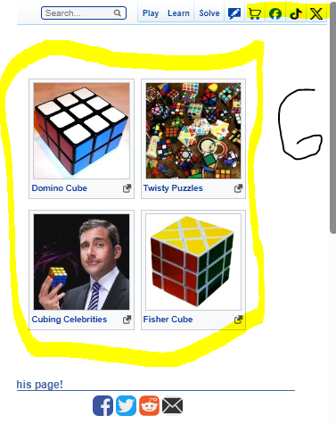

1.  Ruwix has an option for all variety of cube types. This is a feature I would like to incorporate into my program; however, I believe it may greatly increase the time requirements. As such this will be one of the last features I will add if I add it at all.
2.  A solve function is a staple of a Rubik’s cube program and is a feature I will add to my program. However, Ruwix have incorporated it by having you make the cube layout, allowing you to solve cubes that are not a part of the program. I will likely have my solve function solve your current cube, removing the requirement to enter the cube layout but stopping you from entering non-program cubes.
3.  A stopwatch is useful for people curious about their solve time and especially speed cubers. This is an additional feature I hope to add to my program.
4.  Ruwix has a simple-looking controls guide. However, it requires users to know the correct terminology. I believe this creates an unnecessary barrier to entry for non and new cubers. Therefore, I will likely create a more intuitive guide for my program, perhaps a visual one to make it obvious what each button press does.
5.  A shuffle/scramble function is another stable of Rubik’s cube program, and will be one of, if not the first feature I add to my program.
6.  Ruwix has links to their other pages and social media. I believe this creates unnecessary visual clutter and creates an ugly UI. I will endeavour to avoid this in my program.
7.  Ruwix also allows for rotating the cube with the cursor. Whilst I like the idea of this it can often lead to the cube being slanted which is very hard to undo. Due to this I will likely only allow for fixed rotation.

#### Cube Solver

[Online NxN Rubik's Cube Solver and Simulator (cube-solver.com)](https://cube-solver.com/)

1.  This is an option for other cube types/sizes. I believe this is a feature I should include in my program.
2.  This is an option to modify the animation speed. This offers more convenience for the users, and I would also like to include this, however this is not important overall.
3.  The black background is much easier to look at than the Ruwik’s one and something I would like to include. However, as this is largely down to user preference I will try to make it an option for the user.
4.  1) This is a link to a guide on how to solve a Rubik’s cube. Whilst I do not like the idea of linking to another website, I do the idea of an easily accessible guide.
5.  
6.  This allows you to recreate cube positions from other cubes/games. I will consider adding this feature.
7.  1) This shows steps to solve the cube and can do it automatically. Whilst I like it being automatic, it is incredibly unoptimized and can take hundreds of steps to solve a 5 move scramble. I will likely add a more optimised version of this.

    2) This is a link to an optimised solver; it requires you to input your cube position as it is a link to another website. I will not be implementing this.

8.  This scrambles the I will definitely add this feature.
9.  This allows you to reset the cube to its original position, also being solved. I had not considered this but will add this feature.
10. This program also has a 3d interactive cube, which I find to be much more responsive than the previous solution’s version. I will attempt to implement this.

#### Grubiks

<https://www.grubiks.com/puzzles/rubiks-cube-3x3x3/>

1.  This resets the cube. As mentioned on the last program, I had not considered this, but it is a useful feature I will include.
2.  A scramble button, a basic feature I will definitely include.
3.  Like with the first program, it has a 3d interactive cube that I find to be clunky and would rather have a non-interactive cube.
4.  This provides options for many different types of cubes, which is something I will try to implement.
5.  This provides solvers for each type of cube. Again, this requires manually creating the cube position which is something I want to avoid. I do however want a solver for each cube type I implement.

## Features

### Essential Features

#### The Cube(s)

The most important part of a Rubik’s program, the actual cube. I will implement a 3d cube which uses the keyboard as a controller. This will allow for having a 3d cube whilst avoiding the clunky interface that other programs had.

In addition to the standard 3 by 3 cube, I will add additional cube sizes. I will add 2 by 2 and 4 by 4 cubes, as well as non-cube variations. This allows for more variation in the program, helping prevent people getting bored.

#### Scrambler

Perhaps the most useful feature of the program, this allows people to have a cube they have to solve without having to scramble it themselves, meaning they can’t just undo the moves done to scramble it, as they don’t know them. This will utilise lots of randomness to ensure each scramble is different.

#### Solver

A common feature of Rubik’s cube programs, this will solve the Rubik’s cube. I will have this solve the current cube position instead of having the user input one, as I feel this makes it more accessible and easier to use. This can help people learn to solve cubes by showing them how to do it.

#### Tips/hints

I will implement a simple multi-stage guide to tell users what they should be attempting to do next to solve the cube. These stages will consist of multiple moves the user has to do by themselves. This will help the user learn how to solve the cube.

In the case a user gets stuck, there will also be a hint feature that utilises the solver to tell/show the use the next move they should do. This will help to ensure they do not get stuck and give up.

#### Timer

I will also implement an optional timer that starts of the first turn of cube and stops when the cube is solved. This will appeal to speed cubes allowing them to easily time themselves, thereby increasing the amount of people this program will appeal to.

#### Reset

A reset function will reset the cube to its default solved position and orientation, allowing users to quickly start again if they do give up on a cube.

#### Online leaderboard

I will implement an online leaderboard to encourage competition and giving users goals to strive for. I will have a leaderboard for each cube that shows the number of moves and the time taken.

#### Login System

A login system will allow for user scores to be saved as well as other user data. I will also add a guest

#### Guide

I will also need a guide, so players know how to play.

#### Save

I will add a save feature that will record and store the cube position.

#### Mouse Controls

I will attempt to add easy-to-use mouse controls.

#### Game History

This will allow users to track their progress and have measurable improvements.

### Limitations

#### 3D

Due to the limited amount of time and my unfamiliarity with 3D software in python, I am going to be unable to implement a true 3D interactive cube.

#### Multiple Cubes

As each cube would require its own logic and interactions, it would take an inordinate amount of time to implement multiple cubes. As such I am only going to implement a 3x3 cube.

#### Explained Tips/Hints

Due to the of possible scenarios and my limited knowledge on cubing techniques, it is outside of my capabilities to explain to the user why the next move is best.

#### Online Leaderboard

As I do not have the resources or money to host a server, I will have to limit this to a local leaderboard.

#### Mouse Controls

As I am not sure how I would add this whilst avoiding the ‘clunky’ experience I had on other programs and am concerned about time restrictions I will not add this.

### Requirements

#### Hardware

• 1.5 Ghz CPU or faster

• On-board graphics or any GPU

• 1 GB RAM

• 1080p display (recommended)

#### Software

• Python 3.11 or newer

• Pygame

• Tkinter

• Windows 7 or newer

#### Standard Cube

A standard 3 by 3 cube, that at the very least looks 3d if it isn’t, is a must. It is the centre point of the program and there is no point in the program without it.

#### Scrambler

This is a standard Rubik’s cube program feature, and my program would be incomplete without it.

#### Solver

Another common feature of a Rubik’s cube program, mine will implement an algorithm to ensure efficient solves.

#### Tips/Hints

As the solver will be implemented this will be able to utilise that, making telling the user the next best move trivial.

#### Timer

This is relatively simple in all aspects and thus there is little downside to adding it.

#### Reset

Another feature that is trivial to add, only requiring a default state I can revert the cube to and wiping any move history.

#### Local Leaderboard

A local leaderboard should be included so people on the same device may compete with each other.

#### Login System

As I have made a login system in lesson it will be easy to adapt for my program

#### Guide

This is an important feature to add as otherwise users would have to discover how the program works by themselves.

#### Save

Utilising the login system, this shouldn’t be too hard to add, and will make the program more accessible as games can be stopped and continued later.

#### Game History

This should be reasonably simple to add, and I consider it an important feature for user retention.

## Success Criteria

• There should be a professional looking visual representation of a 3-dimesional Rubik’s cube as this is the core of the program and a non-standard cube layout (e.g. a net) may confuse users.

• The cube should have the correct logic - the result of any moves should match the result of performing the move on a real Rubik’s cube.

• There should be a scramble feature able to produce a scramble for the user to solve. The scramble must be possible to solve.

• A solver feature should be included. This should be able to solve the cube move by move, allowing the user to see the steps required to solve it so they may learn from it.

• A hint feature should tell the user the next move they should make if they require help, as to decrease the chance that the user simply gives up.

• A timer function should be included to incentivise competitiveness. In line with this the timer must be as easy to use as possible, it should not cause any delays. It will automatically start upon the user’s first move and automatically stop when the cube is solved.

• A local leaderboard will be included to allow people to compete. This should display, at a minimum: the ten quickest solve times, the respective usernames, and number of moves required.

• The leaderboard should only include solves that did not utilise the hint or solve functions.

• There should be a straightforward login system that utilises encryption and/or hashing for security.

• There should be a clear and concise guide to using the program to prevent any confusion.

• There should be a simple to use save function to allow users with limited time to play whenever they wish without worrying if they have enough time for a complete solve.

• The save function should be able to run automatically to prevent users from losing progress should they forgot to save or something unexpected happens – e.g. power loss.

• A game history function should be included to allow users to see how they have progressed overtime.

# Design

## Problem Decomposition

### Table

| Sub-problem                                    | Why this is suitable                                                                                                                                                                                                   | Parent problem(s) | Child problem(s)       |
|------------------------------------------------|------------------------------------------------------------------------------------------------------------------------------------------------------------------------------------------------------------------------|-------------------|------------------------|
| 0 – Rubik’s Cube Program                       | It is the entire program and requires decomposing                                                                                                                                                                      | N/a               | 1, 12                  |
| 1 – Login page                                 | This is important to allow users to have their own accounts and has many complicated aspects                                                                                                                           | 1                 | 2, 6, 10               |
| 2 – Sign in with existing account              | Users need to be able to access their account                                                                                                                                                                          | 1                 | 3                      |
| 3 – Verify username and password               | The entered details must be checked against stored encrypted and/or hashed details                                                                                                                                     | 2                 | 4, 5                   |
| 4 – Load account details                       | The account details must be retrieved from a file and prepared for that user                                                                                                                                           | 3                 | 12                     |
| 5 – Offer alternative options                  | The user must be able to rectify a mistake when logging in                                                                                                                                                             | 3                 | 2, 6                   |
| 6 – Create new account                         | New users must be able to create an account to have access to all the features an account offers                                                                                                                       | 1, 5              | 7                      |
| 7 – Check details are valid                    | The details entered must be able to be handled by all the code that may interact with it, including the code for logging in. E.g. the username must be unique                                                          | 6                 | 8, 9                   |
| 8 – Create user’s account                      | The new account must be created, with files in the appropriate format showing no game history, saves, etc.                                                                                                             | 7                 | 12                     |
| 9 – Display correct error message              | The user must be informed why the details are invalid and how to fix their mistake                                                                                                                                     | 7                 | 6                      |
| 10 – Guest option                              | For new users who may not yet want to create an account must be a way for them to still use the program                                                                                                                | 1                 | 11                     |
| 11 – Generate temporary account                | A temporary account with no previous details that will only exist while in use must be created                                                                                                                         | 10                | 12                     |
| 12 – Start game                                | The core of the program, containing all the features of the game                                                                                                                                                       | 0                 | 13, 31, 38             |
| 13 – Display cube and buttons                  | The cube and button icons must be loaded and displayed for the user to see                                                                                                                                             | 12                | 14, 16                 |
| 14 – Detect keyboard inputs                    | Any inputs from the keyboard must be detected and handled, as this is the user’s primary way of interacting with the program                                                                                           | 13                | 15                     |
| 15 – Update Cube                               | The turns/rotations indicated by the user via the keyboard must be executed                                                                                                                                            | 14                | N/a                    |
| 16 – Detect button presses                     | The user’s secondary method of interacting with the program, this is how they will access the additional features                                                                                                      | 13                | 17, 18, 19, 20, 22, 27 |
| 17 – Load 3D cube                              | The core program should be loaded for the user to interact with                                                                                                                                                        | 16                | N/a                    |
| 18 – Load cube guide                           | A simple guide for the user should be loaded, allowing them to learn how to use the program                                                                                                                            | 16                | N/a                    |
| 19 – Perform a random set of moves             | Multiple random moves need to be executed to scramble the cube, providing the user a challenge to try and solve                                                                                                        | 16                | N/a                    |
| 20 – Calculate the next step to solve the cube | This will require a large algorithm to evaluate what the next step should be                                                                                                                                           | 16                | 21                     |
| 21 – Repeat until solved                       | The algorithm in step 20 needs to be rerun until the cube is solved, meaning this process must also be able to recognise when the cube is solved                                                                       | 20                |  N/a                   |
| 22 – Load game history from file               | The user’s username must be searched from a file, found, and then all the corresponding data must be parsed into the program, all whilst being reasonably fast                                                         | 16                | 23                     |
| 23 – Display game history                      | The user’s game history must be displayed in a user-friendly manner without affecting the user’s ability to use the program                                                                                            | 22                | 24, 25, 26             |
| 24 – Date and time started                     | The date and time are crucial for the user to be able to track their progress                                                                                                                                          | 23, 28            | N/a                    |
| 25 – Time to solve                             | The time to solve is the main way to measure someone’s skill at cubing                                                                                                                                                 | 23, 28            | N/a                    |
| 26 – Moves to solve                            | Moves to solve is another method to measures someone’s skill at cubing, and whilst not as popular, it is a more accessible for people                                                                                  | 23, 28            | N/a                    |
| 27 – Load leaderboard data from file           | The ten lowest times to solve and ten lowest moves to solve must be loaded from a file, meaning the entire file must be searched, but this must be done quickly                                                        | 16                | 28                     |
| 28 – Display leaderboard                       | Multiple pieces of data need to be presented in a reasonable manner which allows the user to see all the important information without crowing the screen and limiting the user’s ability to interact with the program | 27                | 24,25,26, 29           |
| 29 – Username                                  | The username is important so that people can see who they are competing against and be inclined to challenge them                                                                                                      | 28                | N/a                    |
| 30 – Detect player started                     | The timer function must start running immediately after the user’s first cube interaction, meaning this function must either always be checking for a cube interaction                                                 | 12                | 31                     |
| 31 – Start timer                               | The timer must be started in a manner that will persist while the program runs and will not be affected by things like frame rate                                                                                      | 30                | 32                     |
| 32 – Detect player finished                    | The cube state must be checked after every move by the user to see if it is solved                                                                                                                                     | 31                | 33                     |
| 33 – Stop timer                                | The timer must be stopped, and the time taken recorded                                                                                                                                                                 | 32                | 34, 35                 |
| 34 – Update leaderboard                        | The leaderboard must be updated with the date and time, time to solve, moves to solve, and user’s username.                                                                                                            | 33                | N/a                    |
| 35 – Update game history                       | The user’s game history must be updated with the time taken, moves taken, and the data and time.                                                                                                                       | 33                | N/a                    |
| 36 – Detect cube interaction                   | After each move on the cube the save function should be run                                                                                                                                                            | 12                | 37                     |
| 37 – Save cube position                        | The complete cube position must be saved in a file so that the exact cube position can be recalled at a later date                                                                                                     | 36                | 38                     |
| 38 – Save time passed                          | The amount of time passed and move count must also be saved so that they can continue being updated when the game continues                                                                                            | 27                | N/a                    |

### Flowchart

The following flowchart has been designed using decomposition to help show the logical steps of the program and to see where similar steps exist so one function can be coded to complete each , decreasing the code requirement.

## Solutions

### Sorting Algorithms

A sort algorithm moves each element in a list so that they follow an order. Each algorithm described will assume sorting from smallest to largest, although this may not be the case in my program.

#### Bubble

Bubble sort involves going to each element and repeatedly swapping it with the element after it if the element after it is smaller. Time complexity O(n\^2), space complexity O(1).

#### Insertion

Insertion sort works by creating a sub-list at the start of the list with initial length 0, and then moving adding each element that is out of the sub-list into the sub-list, placing it in order as this is done, until the sub-list is the entire list and in order. Time complexity O(n\^2), space complexity O(1).

#### Merge

Merge sort works by recursively splitting the list until each list has length one, and then combining each list and placing the elements in order as this is done, until all lists are sorted back into one list. Time complexity O(n log n), space complexity O(n).

#### Quick

Quicksort works by picking any element of the list as a pivot, and then moving all smaller elements to the left of the pivot and all larger elements to the right of the pivot. Then each side of the pivot is considered as a sub-list and recursively quick sorted, until each sub-list has length one, when the list will be sorted. Time complexity O(n log n), space complexity O(log n).

### Searching Algorithms

A search algorithm finds the position of an element in a list. The 2 I may be using have space complexity of O(1).

#### Linear

Linear search works by starting at position 0 of the list and moving to the next element until it matches the desired element. Time complexity O(n)

#### Binary

Binary search works by repeatedly splitting an ordered list. It starts by looking at the middle of the list. If the element is found, the middle of the list is its position. If the element being looked at is lower than the desired element (assuming the list is ordered smallest to largest), then considers everything to the right of the list as a sub-list (using low and high points), and then repeats the process. Time complexity O(log n).

### Cube Algorithms

#### Image

I will need to have an algorithm to create the image of cube. It may draw the cube as well, or if it does not it will return the image of it. I will decide which it does when I have started developing my program and have a better idea of how it will work, although I imagine it will work via return. The image will be gotten by drawing each individual square on the cube onto a surface, with their colour being dictated by a 3d array.

#### Turns

When the user inputs their move I will need to have a function to process this. It will need to update a 3d array that stores the cube’s state, correctly swapping or maintaining the colour stored in each position. I may use the numpy library to help with this, as it has many functions for working with arrays, which my Rubik’s cube will use.

#### Rotations

When the user inputs a rotation the cube array needs to be updated so that each face is moved to do this rotation. However, it needs to appear to the user as the cube is unchanged, and that they are simply looking at a different part. The turns function may be useful for this, although I will have to ensure there is nothing to indicate to the user that the turns function has been used (e.g. if the number of moves is recorded, this should not be updated)

#### Scramble

There should be a function that randomises the cube state to provide a cube for the user to solve. As such, the scramble function should also ensure the cube state produced is one that is possible to solve. I will use a series of turns to scramble the cube to ensure that the cube is possible to solve as each turn would solve the cube. This will likely utilise the random library to help ensure the cube state produced is truly random and not biased by me.

#### Solver

The program is also meant is also meant to have a solver. After some research I have found the best method for this is likely a long algorithm consisting of many if statements that is run repeatedly until the cube is solved. However, this would take a long time and be tedious to implement. As such, I may initially use a stack consisting of every move the user has done and what moves were done to scramble the cube, and then I could pop elements from the stack and do the opposite of them to solve the cube. This method would be inefficient and may take much longer to solve the cube than required, but it would be a lot easier to implement initially, and I could look into implementing the ‘proper’ algorithm in later versions.

#### Hints

The hint function may be able to utilise the solver and simply get the next move from that function, although this may require editing the solve function slightly to allow a single move to be gotten.

#### Timer

The timer needs to be automatically triggered when the users , although starting could be defined as either when the scramble function finishes or when the user makes their first move. I believe it would be easier to start the timer when the scramble function finishes so this is what I will do initially, however the World Cube Association allows contestants some time to inspect the cube scramble before they must start solving it, so I believe the correct thing to do would be to start the timer when the user makes their first move. As such I will endeavour to implement this in my later versions. However, this may not be something that is appropriate in the timer itself, and instead the automatic starts and stops may be managed by a different section of code. The timer itself needs to manage creating a timestamp of when the timer is started, and tracking the amount of time passed since then, and stopping the timer when required.

#### Leaderboard

The leaderboard function will need to check all users solves to sort them from quickest to slowest, and check if they are eligible to be on the leaderboard (they mustn’t have used the solve or hint feature). As more and more solves are recorded the time taken to do this will increase, potentially eventually taking an unreasonable amount of time. As such, I will create a sorted list of the top ten quickest eligible solves (which may be changed to a leaderboard of every solve in a later version) which every solve will be checked against at the time of solve to see if the list needs to be updated. This way loading the leaderboard will take the same amount of time regardless of how many users solves there are as all that needs to be done is a list must be loaded.

#### Login

A login system must also be implemented to manage users and their associated data. From some of my previous coding projects I have a premade login system which I can import and utilise instead of creating another login system. However, this login system is far from perfect, so in my later versions of the project I may improve this login system or simply find a better one.

Initially I will use my premade one which will call a function with a username as a parameter, so I will need to create user system that has an appropriate function to load the user’s data into the program and will store the user’s game related data, as my login system only handles login data.

#### Guide

The program will require a guide to instruct users on how to use the cube. To achieve this, I will get the image a default cube by reusing the function for getting the actual used cubes image and then add arrows to the image to show what turns and rotations will be done for corresponding key presses.

#### Save

A save function should save users progress so that they may return to a solve they are in the middle of if they have to leave for any reason/they run into any computer problems. The save function should run automatically, and not run to often so as to not cause performance issues. To do this I may use threading to allow the save function to run (and sleep) in the background so as to allow the main program to run uninterrupted.

#### Game history

There should be a game history function to allow users to see their past games and progress. This must get data from a user’s data file and parse it out to display data about past games in a manner the user understands. This therefore also necessitates saving data about every attempted solve, which will require getting the time taken, moves taken, cube state (which will be a 3d array), and possibly the original scramble.

## Useability Features

Useability features are important to ensure the game is fun and accessible to everyone. If users have to spend too long learning how to use the program, they may get bored and stop using the program, or have servery decreased enjoyment.

As such, I will be using simple keyboard controls for the main part of the game, as this is the simplest and most accessible method of interaction for many inputs, and unlikely to prevent anyone from being able to play or causing any confusion.

I will also be utilising simple point and click navigation of the program and large, sometimes graphical, buttons, are these are also simple to understand, and point and click navigation is the standard that most people will be familiar with.

## Data and Variables

| Variable Name | Type                    | Description                                                                                                                                                                                                             | Sample                                                                                                                 |
|---------------|-------------------------|-------------------------------------------------------------------------------------------------------------------------------------------------------------------------------------------------------------------------|------------------------------------------------------------------------------------------------------------------------|
| width         | Int                     | The screen width, useful for creating the game window and positioning elements to be placed on it                                                                                                                       | 1600                                                                                                                   |
| height        | Int                     | The screen width, useful for creating the game window and positioning elements to be placed on it                                                                                                                       | 900                                                                                                                    |
| screen        | Pygame.Surface          | The displayed screen on which every item to be displayed must be placed                                                                                                                                                 | N/a                                                                                                                    |
| used_cube     | 3D array                | This array will represent the cube and store the colour at each position.                                                                                                                                               | 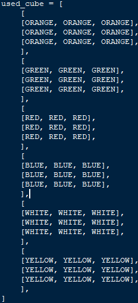       |
| BLACK         | Tuple                   | This will store the RGB value of the colour to be used throughout the program. As this is a colour it will be stored as a constant.                                                                                     | (0, 0, 0)                                                                                                              |
| WHITE         | Tuple                   | This will store the RGB value of the colour to be used throughout the program. As this is a colour it will be stored as a constant.                                                                                     | (255, 255, 255)                                                                                                        |
| YELLOW        | Tuple                   | This will store the RGB value of the colour to be used throughout the program. As this is a colour it will be stored as a constant.                                                                                     | (255, 255, 0)                                                                                                          |
| ORANGE        | Tuple                   | This will store the RGB value of the colour to be used throughout the program. As this is a colour it will be stored as a constant.                                                                                     | (255, 165, 0)                                                                                                          |
| RED           | Tuple                   | This will store the RGB value of the colour to be used throughout the program. As this is a colour it will be stored as a constant.                                                                                     | (255, 0, 0)                                                                                                            |
| GREEN         | Tuple                   | This will store the RGB value of the colour to be used throughout the program. As this is a colour it will be stored as a constant.                                                                                     | (0, 255, 0)                                                                                                            |
| BLUE          | Tuple                   | This will store the RGB value of the colour to be used throughout the program. As this is a colour it will be stored as a constant.                                                                                     | (0, 0, 255)                                                                                                            |
| GREY          | Tuple                   | This will store the RGB value of the colour to be used throughout the program. As this is a colour it will be stored as a constant.                                                                                     | (169, 169, 169)                                                                                                        |
| Cube3D        | Class                   | This will manage creating the image of the 3D cube and drawing it, as well as updating the image and storing the position it should be drawn to (as this is unlikely to change in my program)                           |  |
| CubeGuide     | Class                   | Similar to Cube3D, CubeGuide will manage the drawing and updating the guide cube, and storing data, although instead of making the guide cube image from scratch this class will utilise inheritance and polymorphism.  |  |
| default_font  | Pygame.freetype.sysfont | default_font will hold the main font I will use throughout my program to display text, to ensure it is consistent throughout.                                                                                           | default_font = pygame.freetype.SysFont("calibri", 15)                                                                  |
| moves         | Stack (list)            | moves will store every move the player makes so that the solve function can pop and undo moves repeatedly to solve the cube for the user.                                                                               |                                                                                                                        |

## Validation

Throughout the program I will need to validate various aspects.

One thing I will validate is screen positions. A position that an image is going to be blitted to should be validated to ensure it is on the screen. This will raise an error in case an invalid screen position is calculated.

Another form of validation is handling invalid key presses. Pygame itself handles this, as all key presses are added to the events list with their key recorded as type. You can then simply check for events with the key type of keys that are supposed to be used, and any other key presses will simply be ignored.

The last form of validation will be used with the image of the cube used for the guide cube. I want to display the default cube for the guide image\_ and I don’t want it to be able to be changed. To achieve this, I will check if the guide cube image is being displayed and ignore any cube interactions if it is.

## Iterative-Development Test Data

Due to how difficult it would be ensure that the changes to a 3D array correctly match a real Rubik’s cube, and how reliant on visual output my program is, am going to test some elements based on their display to a pygame window.

| Test No. | What is being tested                   | Description                                                                                                                                                                                          | Method                                                                                                                                                                                                                                                                               | Expected Output                                                                                                                             | Pass/Fail |
|----------|----------------------------------------|------------------------------------------------------------------------------------------------------------------------------------------------------------------------------------------------------|--------------------------------------------------------------------------------------------------------------------------------------------------------------------------------------------------------------------------------------------------------------------------------------|---------------------------------------------------------------------------------------------------------------------------------------------|-----------|
| 1        | 3D cube algorithm                      | There should be an image algorithm that either returns a pygame.Surface containing an image of the display the cube to the screen.                                                                   | Blit the image returned by the function to the screen or call the function, inside the main game loop.  Repeat whilst making changes to used_cube.                                                                                                                                   | An image should be and it should match used_cube.                                                                                           |           |
| 2        | Cube turn – vertical, left, up         | Executing the turns function with the correct parameters for the given turn should result in the leftmost column being rotated upwards.                                                              | Execute the turns function with the parameters for the turn. Run the cube display, the display should show the new cube state. The same rotation should be done to a real Rubik’s cube.                                                                                              | The image of both cubes should be exactly the same.                                                                                         |           |
| 3        | Cube turns – vertical, middle, up      | Executing the turns function with the correct parameters for the given turn should result in the middle column being rotated upwards.                                                                |                                                                                                                                                                                                                                                                                      |                                                                                                                                             |           |
| 4        | Cube turns – vertical, right, up       | Executing the turns function with the correct parameters for the given turn should result in the rightmost column being rotated upwards.                                                             |                                                                                                                                                                                                                                                                                      |                                                                                                                                             |           |
| 5        | Cube turns – vertical, left, down      | Executing the turns function with the correct parameters for the given turn should result in the leftmost column being rotated downwards.                                                            |                                                                                                                                                                                                                                                                                      |                                                                                                                                             |           |
| 6        | Cube turns – vertical, middle, down    | Executing the turns function with the correct parameters for the given turn should result in the middle column being rotated downwards.                                                              |                                                                                                                                                                                                                                                                                      |                                                                                                                                             |           |
| 7        | Cube turns – vertical, right, down     | Executing the turns function with the correct parameters for the given turn should result in the rightmost column being rotated downwards.                                                           |                                                                                                                                                                                                                                                                                      |                                                                                                                                             |           |
| 8        | Cube turns – horizontal, top, right    | Executing the turns function with the correct parameters for the given turn should result in the upper row being rotated right.                                                                      |                                                                                                                                                                                                                                                                                      |                                                                                                                                             |           |
| 9        | Cube turns – horizontal, middle, right | Executing the turns function with the correct parameters for the given turn should result in the middle row being rotated right.                                                                     |                                                                                                                                                                                                                                                                                      |                                                                                                                                             |           |
| 10       | Cube turns – horizontal, bottom, right | Executing the turns function with the correct parameters for the given turn should result in the lower row being rotated right.                                                                      |                                                                                                                                                                                                                                                                                      |                                                                                                                                             |           |
| 11       | Cube turns – horizontal, top, left     | Executing the turns function with the correct parameters for the given turn should result in the upper row being rotated left.                                                                       |                                                                                                                                                                                                                                                                                      |                                                                                                                                             |           |
| 12       | Cube turns – horizontal, middle, left  | Executing the turns function with the correct parameters for the given turn should result in the middle row being rotated left.                                                                      |                                                                                                                                                                                                                                                                                      |                                                                                                                                             |           |
| 13       | Cube turns – horizontal, bottom, left  | Executing the turns function with the correct parameters for the given turn should result in the lower row being rotated left.                                                                       |                                                                                                                                                                                                                                                                                      |                                                                                                                                             |           |
| 14       | Scramble                               | The scramble function should randomly position the individual squares whilst still ensuring that the cube is solvable.                                                                               | Add a delay between each move in the scramble function. Run the scramble function and follow along with a real Rubik’s cube.                                                                                                                                                         | Each move done by the scrambler should be possible on the real Rubik’s cube.                                                                |           |
| 15       | Solver - solving                       | The solve function should solve the cube, showing the user each step, ensuring that each move is possible and not simply changing the used_cube to fit as needed.                                    | Manually scramble the cube, doing each move to a real Rubik’s cube as well. Run the solver and follow the moves on the Real Rubik’s cube.                                                                                                                                            | Each move done by the solver should be possible on the real Rubik’s and at the end the cube should be solved.                               |           |
| 16       | Solver – stop solving                  | If used_cube reaches a solved state, the solver should stop solving, regardless of if there something such as a moves list indicates there are more moves to do to solve the cube.                   | Manually scramble the cube, ensuring that you return to a solved state at least once then scramble from there. Run the solver.                                                                                                                                                       | The solver should stop when it reaches the first solved state.                                                                              |           |
| 17       | Check solved                           | There should be a function to check if a cube state is solved or not.                                                                                                                                | Test the function using multiple different cube states, some of which are manually or automatically scrambled.                                                                                                                                                                       | The outputs should match the given cube state.                                                                                              |           |
| 18       | Hints                                  | The hint function should complete one move towards the solve. It must only be one and it must help solve the cube.                                                                                   | Scramble the cube then run the runt the hint function. Note the move that it makes. Undo that move and then run the solver (test 15 must have passed).                                                                                                                               | Only one move should be completed by the hint function. The move should match the one done by the solver.                                   |           |
| 19       | Timer – time elapsed                   | The timer should correctly record the amount of timer that has passed since it started                                                                                                               | Start the timer. Wait for 10 seconds (counted via a trusted, real, timer). Print the time elapsed.  Repeat a few times with various amounts of time waited.                                                                                                                          | The trusted timer and the timer being tested should have a matching (or very similar, to account for human error) times.                    |           |
| 20       | Timer – auto start                     | The timer should automatically start upon scramble.                                                                                                                                                  | Scramble the cube. Solve the cube. Scramble the cube, use hint function. Scramble the cube. Use the solve function. Scramble the cube.  Monitor the time elapsed during this.                                                                                                        | Each time the cube is scrambled the timer should start,                                                                                     |           |
| 21       | Timer – auto stop                      | The timer should automatically stop upon being solved.                                                                                                                                               |                                                                                                                                                                                                                                                                                      | Upon being solved and when the solver is used, the timer should stop. The timer should not stop if these do not occur.                      |           |
| 22       | Leaderboard – Eligibility check        | Each entry should be checked to see if they are faster than the slowest time on the leaderboard, to see if they have made it onto the leaderboard.                                                   | Submit a completion with a slower completion time than the slowest. Submit a completion with a faster time than the slowest. Submit a completion time identical to the slowest.                                                                                                      | Only the completion with the faster time should be considered for updating the leaderboard.                                                 |           |
| 23       | Leaderboard – add entry                | If the leaderboard isn’t full any completion should be added to the leaderboard. If the leaderboard if full and entry is eligible, the new entry should replace the slowest time on the leaderboard. | Add an entry when the leaderboard is empty. Add an entry when the leaderboard is half full. Add an entry when the leaderboard is full.                                                                                                                                               | The first two entries should be automatically added to the leaderboard. The last entry should replace the slowest entry on the leaderboard. |           |
| 24       | Leaderboard – sort leaderboard         | When a new completion is added to the leaderboard, the leaderboard needs to be sorted to ensure that completion ends up in the correct position. The list should be ordered by ascending times.      | Sort the leaderboard when it is already in order. Sort the leaderboard when it is in descending order. Sort the leaderboard when it is randomised. Sort the leaderboard when 2 identical times exist.                                                                                | Each leaderboard should end up sorted. Manually check this.                                                                                 |           |
| 25       | Leaderboard – save times               | The ordered list of leaderboard times should be able to be saved to a text file so that they are kept even when the program ends.                                                                    | Save the leaderboard when it is empty. Save the leaderboard when it has no completions. Save the leaderboard when it is half full. Save the leaderboard when it is full.  In each case close the program and start it again, attempting to load these saves.                         | In each case the text file should be updated with the leaderboard.                                                                          |           |
| 26       | Leaderboard – load saved times         | The saved leaderboard times need to be able to be loaded so they can be displayed and be checked against for any new records.                                                                        |                                                                                                                                                                                                                                                                                      | In each case the leaderboard should be updated to match the text file.                                                                      |           |
| 27       | Guide algorithm -                      | The should either be a function that returns a pygame.Surface or a procedure that draws the image to the screen.   The image should show how to use the cube.                                        | Either blit the pygame.Surface to the screen or call the procedure inside a game loop.                                                                                                                                                                                               | An image should be displayed.                                                                                                               |           |
| 28       | Guide algorithm – prevent moves        | The cube image should only display the default cube and as such it should not allow cube interactions to happen when the guide is being displayed.                                                   | When displaying the cube, try the following: turns, rotations, scrambling and solving.                                                                                                                                                                                               | None of the functions should work. The cube should remain unchanged.                                                                        |           |
| 29       | Save – to file                         | The save algorithm should be able to save all the key data to a text file.                                                                                                                           | Use the save function with a variety of different key information, including extreme test data such as the timer being at 0.0 seconds and the cube already being solved.  In each case attempt loading the program with this saved data, ensuring it is loaded as current game data. | The save file should be updated to include the key data for the user.                                                                       |           |
| 30       | Save – load form file                  | The save algorithm should be manage loading the data from the text file and updating game values so it is as if the saved state has been achieved in the current session.                            |                                                                                                                                                                                                                                                                                      |                                                                                                                                             |           |
| 31       | Save – autosave                        | The save function should automatically run periodically.                                                                                                                                             | Start a game and make some changes to the cube. Then wait the amount of time set between saves. Once this time has passed closer and reopen the program.                                                                                                                             | The cube should be in the same state as it was when the program was closed,                                                                 |           |
| 32       | Game history                           | When a solve is complete, either by the solve function being used, the scrambler being used, or the cube being solved, the data about that solve should be saved to a list of solves.                | Finish a solve using the solver, scrambler, and by solving manually.                                                                                                                                                                                                                 | These three solves should be added to game history list.                                                                                    |           |

## Post-Development Test Data

|   |   |   |   |   |   |
|---|---|---|---|---|---|
|   |   |   |   |   |   |
|   |   |   |   |   |   |
|   |   |   |   |   |   |
|   |   |   |   |   |   |
|   |   |   |   |   |   |

### Test plan

Post development tests will focus on stakeholder

| Test No. | What is being tested             |   | Description                                                                                      | Pass criteria                     | Stakeholder responses. | Pass / Fail |
|----------|----------------------------------|---|--------------------------------------------------------------------------------------------------|-----------------------------------|------------------------|-------------|
| 33       | 3D cube – image.                 |   | There is a 3D representation of a cube.                                                          | All stakeholders must answer yes  |                        |             |
| 34       | 3D cube - professionalism        |   | The 3D cube must look professional.                                                              | Avg. score \>= 70%                |                        |             |
| 35       | Logic – possible states.         |   | It must be possible to reach every possible cube state.                                          | All stakeholders must answer yes. |                        |             |
| 36       | Logic – possible moves.          |   | All moves able to be done to the cube must be possible on a real Rubik’s cube.                   |                                   |                        |             |
| 37       | Controls - cube.                 |   | The controls for interacting with the cube must be simple and intuitive.                         | Avg. score \>= 70%                |                        |             |
| 38       | Controls – program.              |   | The controls for interacting with the program must be simple and intuitive.                      |                                   |                        |             |
| 39       | Scramble.                        |   | There must be scramble function to scramble the cube.                                            | All stakeholders must answer yes. |                        |             |
| 40       | Solver – solves cube.            |   | There must be a solve function that solves the cube.                                             |                                   |                        |             |
| 41       | Solver – showcase moves.         |   | The solve function must show each move being done to solve the cube in an understandable manner. | Avg. score \>= 70%                |                        |             |
| 42       | Hints.                           |   | A hint feature should show the user the next move to make.                                       | All stakeholders must answer yes. |                        |             |
| 43       | Timer – timing.                  |   | A timer should be available to time solves.                                                      |                                   |                        |             |
| 44       | Timer – auto start.              |   | The timer automatically starts.                                                                  |                                   |                        |             |
| 45       | Timer – auto stop.               |   | The timer automatically stops.                                                                   |                                   |                        |             |
| 46       | Leaderboard – image.             |   | There is a leaderboard.                                                                          |                                   |                        |             |
| 47       | Leaderboard – solves.            |   | The leaderboard should display the ten quickest solve times or more, in ascending order.         |                                   |                        |             |
| 48       | Leaderboard – details.           |   | Each entry must display: username, the number of moves required, the time taken.                 |                                   |                        |             |
| 49       | Login System – logs in.          |   | There should be a login system that allows users to login in.                                    |                                   |                        |             |
| 50       | Login System – straightforward.  |   | The login system should be straightforward and easy to use.                                      | Avg. score \>= 70%                |                        |             |
| 51       | Save – loading.                  |   | Upon logging in user data should be loaded.                                                      | All stakeholders must answer yes. |                        |             |
| 52       | Save – automatic.                |   | The save function should run automatically.                                                      |                                   |                        |             |
| 53       | Guide – exists.                  |   | There must be a guide that shows how to use the program.                                         |                                   |                        |             |
| 54       | Guide – user display.            |   | The guide must be clear and concise.                                                             | Avg. score \>= 70%                |                        |             |
| 55       | Game history – exists.           |   | There must be a game history function that displays previous game history,                       | All stakeholders must answer yes. |                        |             |
| 56       | Game history – usefulness.       |   | The game history function must make it easy to see how you have progressed over time.            | Avg. score \>= 70%                |                        |             |

### Quiz template

| Stakeholder name: |                                                                                                                 |             |                    |
|-------------------|-----------------------------------------------------------------------------------------------------------------|-------------|--------------------|
| Test no.          | Question                                                                                                        | Answer type | Stakeholder Answer |
| 33                | Is there a representation of a 3D cube?                                                                         | Yes or No   |                    |
| 34                | How professional does the 3D cube look?                                                                         | 1 to 10     |                    |
| 35                | To your knowledge, is every move that’s possible on a real Rubik’s cube possible on the program’s Rubik’s cube? | Yes or No   |                    |
| 35                | To your knowledge, is every move possible on the program possible on a real Rubik’s cube?                       |             |                    |
| 37                | How well do the cube controls meet the description: simple and intuitive?                                       | 1 to 10     |                    |
| 38                | How well do he program controls meet the description: simple and intuitive?                                     |             |                    |
| 39                | Is there a scramble function?                                                                                   | Yes or No   |                    |
| 40                | Is there a solve function?                                                                                      |             |                    |
| 41                | How well does the solve function show each move done (in regards to you being able to understand it)?           | 1 to 10     |                    |
| 42                | Is there a hint function that shows you the next move to make?                                                  | Yes or No   |                    |
| 43                | Is there a timer to track how long solves take?                                                                 |             |                    |
| 44                | Does the timer start automatically?                                                                             |             |                    |
| 45                | Does the timer stop automatically?                                                                              |             |                    |
| 46                | Is there a leaderboard?                                                                                         |             |                    |
| 47                | Does the leaderboard show the ten quickest solves in ascending order?                                           |             |                    |
| 48                | Does each leaderboard entry display: the username, the time taken, the moves taken?                             |             |                    |
| 49                | Is there a login system?                                                                                        |             |                    |
| 50                | How straightforward to use is the login system?                                                                 | 1 to 10     |                    |
| 51                | Is your user and game data loaded when you log in?                                                              | Yes or No   |                    |
| 52                | Does the save function run automatically?                                                                       |             |                    |
| 53                | Is there a guide to use the program?                                                                            |             |                    |
| 54                | How clear and concise is the guide?                                                                             | 1 to 10     |                    |
| 55                | Is there a function to see your game history?                                                                   | Yes or No   |                    |
| 56                | How easy does the game history function make it to see how you have progressed?                                 | 1 to 10     |                    |

# Implementation

## Prototype One

To begin I will create a simple cube net with the purpose of testing the cube logic. This will be a very graphically simple cube with few features, but it will allow me to test the most important part of my program.

### Development

Cube Display (Net, not 3D):

• [Window](#ProtypeOneDisplayWindow) for display

• Cube [image](#ProtypeOneDsiplayCube)

Cube Logic:

• Data [storage](#ProtypeOneLogicStorage)

• Data [manipulation](#ProtypeOneLogicRotations)

Validation:

• Validation [function](#ProtypeOneValidation)

• Function [usage](#ProtypeOneValidationUsage)

• [Ignore invalid key presses](#ProtypeOneValidationIgnoreInvalidKeyPres)

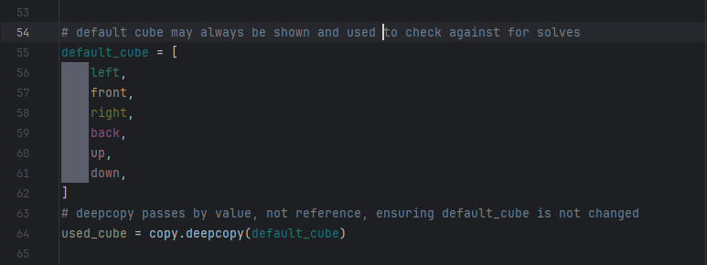

In this section of code, I have initially imported the necessary libraries for later use in the program and then defined some colour’s RGB values. The variable names of the colours have been written in all caps to signify that they are constants. Additionally, they have been written as tuples instead of lists as tuples are immutable.

I have then manually defined the default cube, creating a 2D array for each face, and then combined these into a 3D array. This could have been achieved by using loops, however this method provides a more visual representation of the cube and reduces the risk of an error during this section, allowing me to focus on developing the logic and functions required for the cube. I have called this variable ‘default_cube’ as it is the starting (solved) position of the cube and will be used for checking if the cube is solved – which will be important for the solver, leaderboard and game history. I have then created a deep copy of the cube called ‘used_cube’, which is the cube that will be updated and changed by user actions. A deep copy was used as this creates a new array by value instead of reference, ensuring default-cube is not changed by actions done to ‘used_cube’.

In this section I have created a pygame window for displaying the cube. I have defined width and height as variables as these will be used for positioning images later. I also created the ‘default_colour‘ variable so that I can easily change the background colour without majorly altering the program, which may help with adding it as a feature if that is something I wish to-do at a later date. This is crucial for displaying the cube and all features associated with it.

In this section I have designed a function validate screen positions, ensuring that if a screen position is outside the bounds of what is reasonably expected the program will end. This will be largely redundant in prototype one, due to the static nature of the window being displayed to, however it will become useful in later versions that implement resizable windows, and feature more calculations to display elements, increasing the likelihood of error. Additionally, as prototype one is a small program I could easily test this function without something else causing an error first.

I chose a 4k resolution (3840 x 2160) as this is the largest resolution commonly used by computer monitors – the intended display.

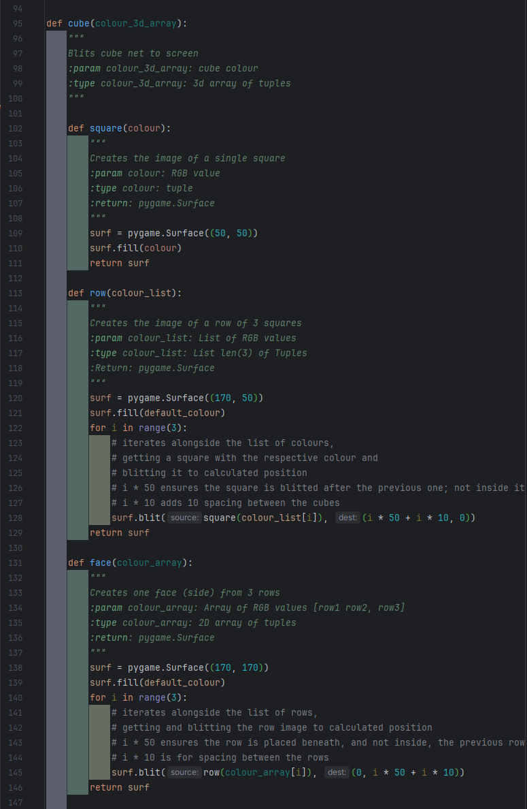

This section serves to create and display a simple cube, although this one is not 3D.

In this section I have coded a function ‘cube’ that will blit the image of the cube onto the screen. The function has ‘colour_3d_array’ as a parameter, it is a 3D array of RGB tuples, wanting either ‘used_cube’ or ‘defaut_cube’ to be given. It works by breaking the 3D array down into single elements, creating the necessary image, and then recombing these images to form a cube. To do this I have created 3 local functions with ‘cube’: ‘square’, ‘row’, and ‘face’.

‘square’ takes in a single RGB colour and returns a 50 pixel by 50 pixel pygame image that is filled with that colour.

‘row’ takes in a list of 3 RGB tuples, creates an image and blits 3 squares to it in a row, with 10 pixels spacing between them, where the colours of the squares are taken from the list in order. It then returns the created image.

‘face’ takes in a 2D array of RGB tuples as a parameter, and for each list it creates a row. These rows are stacked vertically with 10 pixels spacing. It then returns this created image.

As this is a net design, 4 of the faces are in a line with a fixed y value. Therefore, I have used a loop to place these faces. The loop blits the images returned by the ‘face’ function, using the i iterator to give the correct 2D array from the ‘colour_3d_array’ as a parameter.

The iterator is also used for changing the x position of the images: width/2 centres the images, +10 is used for manually adjusting the position of the image to look more centred, i-2 ensures two faces go to the left of the centre and two go to the right, so the image is fully centred, and \*200 ensures faces aren’t placed on top of each other, as well as adding 30 pixels spacing. The y axes is fixed: height/2 places the images at the centre of the screen, and -2/170 removes half of the height of the faces, as the position given where the top left of the image is placed, not the centre.

The up and down faces were placed without a loop. Whilst a loop could be used, I felt this would unnecessary complicate something that can easily be achieved in a few lines of code. Like in the loop, the ‘face’ function is called and the image it returns blitted. For the x position the same logic as in the loop applies, with the iterator equalling 1 as this lines up the net design. For the y position height/2 centres the image, -170 moves the image up above the row of 4 images, + or – 170/2 accounts for the fact the position is of the top eft of the image, + or – 20 is for spacing between the faces, and + or – 10 is for manual adjustment of the images.

This section allows interactions with the cube and is what must be correct to ensure the cube has the correct logic.

In this section of code, I have created a function to handle rotating each section of the cube. This required lots of iterative testing due to the complicated nature of Rubik’s cube logic, and due to me using a trial and error approach to figuring out how the logic works. The procedure takes in Boolean ‘row_col’, int ‘number’ and Boolean ‘backwards’. ‘row_col’ indicates whether the turn is to be done to a row (True) or column (False). ‘number’ indicates which row/column number needs to be done, 0, 1 or 2 along the face. ‘backwards’ allows for the reverse of a turn to be done.

First, I create a ‘loop’ variable set to one, then change it to three is ‘backwards is true. Everything in this function following this is in a loop that iterates based on the ‘loop’ variable. This is because a Rubik’s cube works with 90 degree turns, so turning backwards is the same as turning forwards 3 times.

I then create a deep copy of each face. This is done so these new variables can serve as temp variables, allowing me to change each face without risking losing what the original position of the face was. A deep copy was used as it copies by value, instead of reference, which ensures these temp variables are not changed when the actual cube array is changed.

Next, I create a variable n equal to number as this is quicker to type. I did not want to change the parameter name to n as this would be unclear is read at a later date by someone wanting to use the function.

After that, I have an if statement to check if the operation is to be done to a row or a column. In the row section, I update the horizontal section of ‘used_cube’ by changing each face to the one after it. I then check if the rotation was done to the top or bottom row, and rotate the top or bottom face if they were, as this is what happens with a real Rubiks cube. For the column section, I used a loop to move each square one by one. This helps when it comes to reversing the order of the row and the column when the column rotates to/from the back face, which is achieved by the 2-I and the 2-n. It also allows for the row to be iterated. Then, similar to the row rotation, I check if the column being turned if one of the edge ones and rotate the left or right face.

In this final section of code, I have the main game loop. I first initialise pygame, then I create a while True loop. This loop will always run, only stopping when it encounters an error from trying to execute a pygame command for a pygame window that has been quit.

The majority of this loop is checking for events – the events list is gotten then looped through, and I check for different types of events. If the event is the quit button being pressed, pygame is quit and the program finishes. Every other event is for rotating the cube.

Then I fill the screen with the colour black to create a black background, then call the ‘cube’ function which will blit the cube net image. Then the display is refreshed so the actual image displayed is updated.

### Testing

### 

| Test No. | What is being tested                   | Description                                                                                                                                | Method                                                                                                                                                                                  | Expected Output                                     | Pass/Fail |
|----------|----------------------------------------|--------------------------------------------------------------------------------------------------------------------------------------------|-----------------------------------------------------------------------------------------------------------------------------------------------------------------------------------------|-----------------------------------------------------|-----------|
|          |                                        |                                                                                                                                            |                                                                                                                                                                                         |                                                     |           |
| 2        | Cube turn – vertical, left, up         | Executing the turns function with the correct parameters for the given turn should result in the leftmost column being rotated upwards.    | Execute the turns function with the parameters for the turn. Run the cube display, the display should show the new cube state. The same rotation should be done to a real Rubik’s cube. | The image of both cubes should be exactly the same. | Pass      |
| 3        | Cube turns – vertical, middle, up      | Executing the turns function with the correct parameters for the given turn should result in the middle column being rotated upwards.      |                                                                                                                                                                                         |                                                     | Pass      |
| 4        | Cube turns – vertical, right, up       | Executing the turns function with the correct parameters for the given turn should result in the rightmost column being rotated upwards.   |                                                                                                                                                                                         |                                                     | Pass      |
| 5        | Cube turns – vertical, left, down      | Executing the turns function with the correct parameters for the given turn should result in the leftmost column being rotated downwards.  |                                                                                                                                                                                         |                                                     | Pass      |
| 6        | Cube turns – vertical, middle, down    | Executing the turns function with the correct parameters for the given turn should result in the middle column being rotated downwards.    |                                                                                                                                                                                         |                                                     | Pass      |
| 7        | Cube turns – vertical, right, down     | Executing the turns function with the correct parameters for the given turn should result in the rightmost column being rotated downwards. |                                                                                                                                                                                         |                                                     | Pass      |
| 8        | Cube turns – horizontal, top, right    | Executing the turns function with the correct parameters for the given turn should result in the upper row being rotated right.            |                                                                                                                                                                                         |                                                     | Pass      |
| 9        | Cube turns – horizontal, middle, right | Executing the turns function with the correct parameters for the given turn should result in the middle row being rotated right.           |                                                                                                                                                                                         |                                                     | Pass      |
| 10       | Cube turns – horizontal, bottom, right | Executing the turns function with the correct parameters for the given turn should result in the lower row being rotated right.            |                                                                                                                                                                                         |                                                     | Pass      |
| 11       | Cube turns – horizontal, top, left     | Executing the turns function with the correct parameters for the given turn should result in the upper row being rotated left.             |                                                                                                                                                                                         |                                                     | Fail      |
| 12       | Cube turns – horizontal, middle, left  | Executing the turns function with the correct parameters for the given turn should result in the middle row being rotated left.            |                                                                                                                                                                                         |                                                     | Fail      |
| 13       | Cube turns – horizontal, bottom, left  | Executing the turns function with the correct parameters for the given turn should result in the lower row being rotated left.             |                                                                                                                                                                                         |                                                     | Fail      |
|          |                                        |                                                                                                                                            |                                                                                                                                                                                         |                                                     |           |
|          |                                        |                                                                                                                                            |                                                                                                                                                                                         |                                                     |           |
|          |                                        |                                                                                                                                            |                                                                                                                                                                                         |                                                     |           |
|          |                                        |                                                                                                                                            |                                                                                                                                                                                         |                                                     |           |
|          |                                        |                                                                                                                                            |                                                                                                                                                                                         |                                                     |           |
|          |                                        |                                                                                                                                            |                                                                                                                                                                                         |                                                     |           |
|          |                                        |                                                                                                                                            |                                                                                                                                                                                         |                                                     |           |
|          |                                        |                                                                                                                                            |                                                                                                                                                                                         |                                                     |           |
|          |                                        |                                                                                                                                            |                                                                                                                                                                                         |                                                     |           |
|          |                                        |                                                                                                                                            |                                                                                                                                                                                         |                                                     |           |
|          |                                        |                                                                                                                                            |                                                                                                                                                                                         |                                                     |           |
|          |                                        |                                                                                                                                            |                                                                                                                                                                                         |                                                     |           |
|          |                                        |                                                                                                                                            |                                                                                                                                                                                         |                                                     |           |
|          |                                        |                                                                                                                                            |                                                                                                                                                                                         |                                                     |           |
|          |                                        |                                                                                                                                            |                                                                                                                                                                                         |                                                     |           |
|          |                                        |                                                                                                                                            |                                                                                                                                                                                         |                                                     |           |
|          |                                        |                                                                                                                                            |                                                                                                                                                                                         |                                                     |           |
|          |                                        |                                                                                                                                            |                                                                                                                                                                                         |                                                     |           |
|          |                                        |                                                                                                                                            |                                                                                                                                                                                         |                                                     |           |

### Improvements

11, 12 and 13 should have passed, but did not. I mistakenly used keys y, h, n instead of the keys r, f, v, which are what I chose to use as the keys for those turns. The function itself worked correctly

 

### Program Images

## Prototype 2

### Development

As the scope of prototype 2 was much greater and more complicated than prototype one, I initially split the code into 4 files: main – which is the file to run, and uses pygame to display the cube and features, and to record user inputs; cube – which manages any interactions with the cube, including getting the image; interface – which handles creating complicated visual elements to be displayed such as text and buttons; validation – which handles validating screen positions and anything I may find that needs validation. However, during development, I realised that I was copying some constants, and passing the same variable repeatedly through all the files, so I created a data file to store these commonly used pieces of data. During this I also realised I had made some mistakes with the format of my docstrings, so I also fixed those, and some were unclear, so I fixed that.

Cube display:

• 3D methods [research](#cube-method-research)

• [Cube class](#PrototypeTwoDisplayClass)

• Cube [object](#PrototypeTwoDisplayObjects) and screen creation

• Display [images](#PrototypeTwoDisplayUsage)

Cube Logic:

• Data [storage](#PrototypeTwoLogicStorage)

• [Turns](#PrototypeTwoLogicTurns)

• [Rotations](#PrototypeTwoLogicRotations)

Scramble:

• [Function](#PrototypeTwoScrambleFunction)

• [Usage](#PrototypeTwoScrambleUsage)

Solver:

• [Storage](#PrototypeTwoSolverStorage) (added to by [Turns](#PrototypeTwoLogicTurns) and [Rotations](#PrototypeTwoLogicRotations))

• [Class](#PrototypeTwoSolverClass)

• [Object](#PrototypeTwoSolverObject)

• [Usage](#PrototypeTwoSolverUsage)

Hint:

• [Function](#PrototypeTwoHintFunction) (of Solver)

• [Usage](#PrototypeTwoHintUsage)

Timer:

• [Class](#PrototypeTwoTimerClass)

• [Object](#PrototypeTwoTimerObject)

• [Automatic start](#PrototypeTwoTimerAutomaticStart)

• [Automatic stop](#PrototypeTwoTimerAutomaticStop)

• [Usage](#PrototypeTwoSolverUsage)

Guide:

• [Class](#PrototypeTwoGuideClass)

• [Object](#PrototypeTwoGuideObject)

• [Usage](#PrototypeTwoGuideUsage)

Validation:

• [Class](#PrototypeTwoValidationClass)

• [Object](#PrototypeTwoValidationObject)

• Usage can be seen throughout [Main](#main)

• [Ignore invalid key presses](#PrototypeTwoValidationIgnoreInvalidKeyPr)

• [Ignore cube interactions when on guide](#PrototypeTwoValidationIgnoreForGuide)

#### Cube method research

The first goal of my protype two – past the fixes specified in review, was to have a 3D Rubik’s cube. To achieve this, I first had to decide of a method of displaying a 3D cube, as I had not decided on an exact method to use during development, although I knew it was likely I would use pygame, I couldn’t be completely confident until I tried coding it to see what worked.

I looked into many options, one of which used matplotlib. I found and this code from to get a look into how it might function, I found I wasn’t happy with the results.

In the end I did decide to use pygame, using stretched and angles cubes to give the impression of it being 3D, manually drawing them, without using any complicated 3D libraries. As I coded this myself, I was confident in how it worked and therefore comfortable expanding upon it to create a full Rubik’s cube.

#### Main

As I knew I had made mistakes (albeit small ones) when it came to documentation in prototype one, I endeavoured to have perfect documentation this time. As such, the main file (along with every other file) starts with a doc-string. Then, like in prototype one, importing the necessary libraries, although this time I’m also importing my own files. I chose to import all from data as this is the main file, and as such will end up needing most of the data.

I have also allowed the screen window to be resized by the user, however, most of the calculations to place images on the surface are only done once and will be done before the has the chance to change the screen size, resulting in changing screen size making little difference for the user.

I then create 3 objects – one of each cube type – from the imported cube classes from cube file. These are what draw the image of the cube to the screen, at the position specified, when their update method is ran.

The aforementioned positions are validated by being run through the ValidateScreenPositions class, or more specifically, the class’s run function. This ensures that the positions are within the bounds of the screen and a 4k resolution. Every other screen position in the main file is also validated this way.

Next, I have created a class that manages the buttons for swapping between the different types of cubes that can be displayed (3D, net, guide). As this class only has one purpose and only serves to encapsulate the buttons, it has no constructor, and the two functions are static, meaning that they do the exact same thing regardless of the state of the object they are in.

The buttons are object of the class DisplayOption from the interface file, and they are placed in a list that is a parameter to DisplayBar, which was specifically designed to work with objects of DisplayOption. The buttons are placed in a column in the top left corner of the screen, and this position is validated. The buttons are given the get_image function of their respective cubes and a size of [100, 100], meaning the image they display is what just a shrunk-down version of what will actually be displayed to the screen as the main cube. When a button is hovered, it will be enlarged by 1.5x in each direction, and the cube_bar will account for this and move the images to ensure they do not overlap.

The update function is somewhat unneeded, as running Buttons.update() has the exact same effect as running Buttons.cube_option_bar.update(), however I felt it resulted in cleaner code and helped abstract away unneeded elements.

Then I have defined a variable for whether or not the cube is actively being solve, and 2 for the objects of Solver and Timer respectively.

I then start the game loop. At the start if the game loop I update some key information – mouse_pos and mouse_up, as these are important for the event checks that are about to happen. Mouse up is set to False in case it was being pressed last game loop but isn’t anymore, and it will be one of the first events checked so it can be updated.

I also update the screen size for the validation object in case the user has resized the screen, but as mentioned earlier this has little effect on what and where things are displayed. However, adding this update in now ensures that I don’t forget it if I add more support for resizing the screen at a later date.

I iterate though all the new events, checking for expected inputs. The ‘and …’ portion of line 121 ensures that no cube rotations or turns happen when the cube guide is being displayed, as the cube guide displays the default cube image which isn’t supposed to be changed. I have updated the keys used for left turns so that they now match what is expected. In the portion for the solve key being pressed the timer is deleted as a completion time shouldn’t be awarded for using the solve function. The scramble portion starts the timer as the timer is supposed to start automatically and be as easy to use as possible. The hint feature simply uses the solve function that gets the next move to do, as the hint feature is supposed to just do one move.

In the final part of the game loop, I get and draw all the images to the screen. The if solve_cube section works to do a single move of the solve and wait the calculated amount of time between each move. The else ensures that after each solve the first attribute of solve is reset to True, for the next solve.

The if and elifs on lines 181, 184, and 186 change display_cube to the correct object so that display_cube.update() only has to be written once. The guide portion also writes additional text to the screen. Ideally, this should be apart of the guide_image, but as the classes responsible for the images place the image based on a centre position, adding them would change the position of the cube so it would no longer be centred. As I want to avoid this, I have simply added the text directly to the screen like this.

#### Validation

In a large project, particularly one that will be used by others, error handling is very important of the code, ensuring that any unexpected errors are recorded so that they can be fixed, and so that anyone working with the code knows what went wrong and what to avoid doing. Important sections of code would be within try except statements to handle any errors that do occur.

As my code is relatively simple and static (there is not much that can be changed, so if it works once, it will likely always work), this is far less important for me. However, I wanted to learn more about error handling, and there is nothing to prevent me from using this file in other projects I end up working on, so I decided to do validation . As such, I have created a custom exception for invalid screen positions, which can be raised as an exception, and will document itself in an error file with a timestamp and the position that caused the error, so that if one does occur, I can hopefully identify what caused it and fix it.

I’ve also updated the validation function to check if its within the expected screen size, although I kept the 4k resolution checks in case the screen size ends up incorrect. I also changed it to raise the exception instead of printing an error message and quitting the program.

To prevent having the pass the width and height of the screen each time the validation function is run, I made it into a class that stores the width and height of the screen, and created a function to update that information should it change.

#### Cube

I first import all the required libraries and files, including all the colour constants I have denied in the data file.

I then create the cube and the copy, as well as create a moves list that will store all the moves made. This is vital for the Solve feature, as it works by undoing all of the completed moves. And for the hint feature, as that uses the solve function.

I then create a class for the net design of the cube, so that it can have an update function that will display the cube to the screen at the saved position. The get_image function is very similar to the cube function in prototype one, as it creates the same image. It is a static method as it creates the image based solely on the used_cube variable available in that file. I am able to use the used_cube variable like this as I have no intentions of having any cube states available past the state of the user’s cube and the default image.

I then create a class for the 3D version of the cube, which inherits the CubeNet class, allowing me to reuse the constructor and update methods. The get image function is polymorphed, meaning that its name stays the same, but it works differently than the get image function in the parent class. In this case I have changed it so that it creates and returns a psudo-3D image, using slanted images to give the impression of a 3D cube.

It works by using subfunctions with subfunctions to break the image down into individual cubes, then slowly constructing it, into rows then a face. The surf.colourkey makes the background of the surface transparent, which is important as these slanted cubes can end up overlapping, and would break the image if the not for the transparency,

Unfortunately, despite the similarity of the right, front and top images they are not similar enough that using a single function instead could meaningfully decrease the amount of code required.

Finally, the 3 functions can be called to create the image.

Next, I create the class for the cube guide – an annotated version of the 3D cube which serves as a guide for using the program. This class inherits from Cube3D, again reusing the constructor and update methods. However, whilst I still want to change the get_image function, I also want to be able to use the get_image function from Cube3D. As such, I have used @classmethod instead of @staticmethod. This means that, unlike static methods, it is not completely independent of the class, but it does require the object-specific self, it instead only requires a pointer to the class itself. This allows super() to be used in the function to access methods from the parent class.

I have also added a very basic warning in case the background colour ends up the same colour as the guide arrows, making then impossible to see. Whilst far from a perfect solution, as this is a simple problem, a small error message such as this should be sufficient for anyone to identify the problem should one occur.

Inside the get_image function I created 3 sub-functions. arrow_top creates an arrow aligned to the top slant of the cube that can display text (to instruct the user on what key press will achieve that rotation), the rotation parameter allows any degree of rotation, buts its intended usage was specifically angle=180 to get an arrow for the downwards rotation. arrow_right is similar to arrow_top, just aligned to the right side of the cube. arrow_rotate has no alignment to the cube, instead creating a large arrow to show the direction of rotation.

At the end of the get_image function I first define variables cube_offset_x and cube_offset_y. These are used to help move all the images on the surf whilst maintaining their positions relative to each other. This was important as when I started placing the images I had started with the cube too far to the left, and didn’t have enough space for Y rotation arrow. Thanks to the offset variables I only had to update 2 variables to move everything to the right to make space.

To get the image of the cube, I used the super() function so that I could access Cube3D’s get_image function. I passed True as a parameter as I wanted the guide cube to always show the default image.

Then all the arrows were created and blitted to the surf before it is returned.

The turn function is a slightly updated and renamed version of the rotate function from prototype one. The 2 coding changes are the addition of recording moves and changing the iterator of the loop. Apart from that some small changes were made to the docstring and comments.

The addition of recording moves involved adding ignore_moves as a parameter and lines 585-588 to record the moves. Ignore moves allows moves to be undone by the solver without getting readded to the list.

The iterator was changed to \_ from I as \_ is conventionally used as a throwaway variable, and the loop doesn’t need to know the iteration it is on for any reason, which this indicates.

The rotate function does a rotation to the cube and like the turn function, it adds the move to the moves list. Rotations in the x or y direction are achieved by turning each row or column once. Rotations in the z axis were far more complicated. Whilst I knew what needed to be done physically to the cube, I couldn’t think of exactly how to that whilst using the 3D array. However, I was confident that whatever the solution was it would involve the rotations of face 1 and 3, and face0=face5, face5=face2, etc. As such, I chose to use a trial-and-error approach until I found something that worked.

To scramble the cube whilst ensuring that it was possible to solve, I chose to make many turns, knowing that if the turn function worked correctly it couldn’t result in an impossible position. I used the random library to randomise each turn, and have many turns are made. I arbitrarily chose between 15 and 25 turns, finding this resulted in a sufficiently difficult position. Each move is also added to the moves list so that the solve function can undo them.

For the solve function I created a class, with sleep_time being used in the game loop to ensure each solve takes 5 seconds, assuming there’s no hardware limitations.

The solve function itself first checks if the cube is solved as a guard clause. This prevents the solve function from un-solving a cube just so it can completely empty the moves list. Doing this as a guard clause means checking and returning before the main block of code, so the main block isn’t reached. Guard clauses can be treated as if all the following code is in an else block, but without the need for indentation.

The solve function calculates the time to sleep for that move, before returning pop.move(), which is what will undo the move.

The check_solve function checks whether all squares on a face match the centre square, as this is the case for a solved cube and if this is true for every face, then it must be a solved cube. The not_solved variable will be updated to True if any one of these checks fails, as then the cube can’t be solved. The return includes a not as I want the output to be True if the cube is solved.

The pop_move function is static as it only uses the move list. It gets the last done move from the move list and undoes it, before returning if the moves list is empty or not. It is possible the cube may be solved even when the moves list still has moves in it, but this is checked for in the solve() function, which is its primary usage and where this issue is most likely to occur.

The moves list should ideally be stored in a class, requiring moves to be added by a function, to ensure that all moves added are stored in the correct format, however due to the small scale of this project I felt I could safely access the moves list directly and just ensure I was using the correct format every time I did.

The timer class manages recording the time taken for a solve so far, and in total. It also creates an image with the time taken to display to the user. If the time taken is less than a minute the image displays the time taken rounded to the millisecond, otherwise it displays the time taken in mutes and seconds.

The minutes are obtained by dividing by 60, and this value gets rounded down when it is converted to python. The seconds are obtained using modulus 60, and this also gets converted to an integer, as I did not feel milliseconds were important after the time taken exceeds a minute.

#### Interface

The DisplayOption class creates a button that enlarges when hovered over. It takes a function as a parameter to get an image to display. This allows it to have an updating image. The get_image function gets the image and scales it to the size of the button based on self.size. The background is also made transparent.

The update function will display the button to the screen. It includes an offset as when many buttons are next to each other, and one is enlarged the rest need to move or there will be overlapping. The last size is used as the user will see the image with its last size, not the image about to be gotten, and thus that is the size of the button they expect.

The button checks if it is being hovered by checking if the mouse position collides with its image. If it is, its checked if the mouse button has been pressed. If it has the button action is done. If not, self.size is stored in a temp variable, before self.size is updated to the enlarged size, and then get_image is called. As get image uses self.size, it will return the enlarged image. Self.size is then returned to its original size by using the temp value.

DisplayBar was created to help manage DisplayOption objects. It allows for a bar of vertical or horizontal buttons to be created. With the objects stored sequentially in order from the edge of what they can touch, a loop can be used to check if an object is being hovered and offset all the following buttons by the change that object’s image size, preventing overlap. This also updates all of the DisplayOptions.

The text function returns the image created by rendering the text. The surface’s Rect is returned by .render but it is not needed so I assign it to the throwaway variable. I also run .convert_alpha() on the image as this optimises the image for faster blitting to the screen.

#### Data

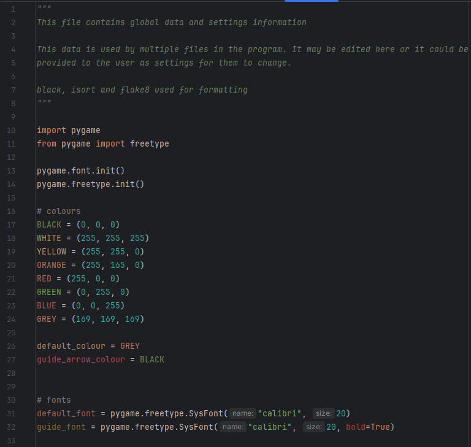

The data file holds key data used by every file, so that I can be easily accessed and updated as needed.

### Testing

### 

| Test No. | What is being tested                   | Description                                                                                                                                                                        | Method                                                                                                                                                                                  | Expected Output                                                                                                          | Pass/Fail |
|----------|----------------------------------------|------------------------------------------------------------------------------------------------------------------------------------------------------------------------------------|-----------------------------------------------------------------------------------------------------------------------------------------------------------------------------------------|--------------------------------------------------------------------------------------------------------------------------|-----------|
| 1        | 3D cube algorithm                      | There should be an image algorithm that either returns a pygame.Surface containing an image of the cube, the cube to the screen.                                                   | Blit the image returned by the function to the screen or call the function, inside the main game loop.  Repeat whilst making changes to used_cube.                                      | An image should be and it should match used_cube.                                                                        | Pass      |
| 2        | Cube turn – vertical, left, up         | Executing the turns function with the correct parameters for the given turn should result in the leftmost column being rotated upwards.                                            | Execute the turns function with the parameters for the turn. Run the cube display, the display should show the new cube state. The same rotation should be done to a real Rubik’s cube. | The image of both cubes should be exactly the same.                                                                      | Pass      |
| 3        | Cube turns – vertical, middle, up      | Executing the turns function with the correct parameters for the given turn should result in the middle column being rotated upwards.                                              |                                                                                                                                                                                         |                                                                                                                          | Pass      |
| 4        | Cube turns – vertical, right, up       | Executing the turns function with the correct parameters for the given turn should result in the rightmost column being rotated upwards.                                           |                                                                                                                                                                                         |                                                                                                                          | Pass      |
| 5        | Cube turns – vertical, left, down      | Executing the turns function with the correct parameters for the given turn should result in the leftmost column being rotated downwards.                                          |                                                                                                                                                                                         |                                                                                                                          | Pass      |
| 6        | Cube turns – vertical, middle, down    | Executing the turns function with the correct parameters for the given turn should result in the middle column being rotated downwards.                                            |                                                                                                                                                                                         |                                                                                                                          | Pass      |
| 7        | Cube turns – vertical, right, down     | Executing the turns function with the correct parameters for the given turn should result in the rightmost column being rotated downwards.                                         |                                                                                                                                                                                         |                                                                                                                          | Pass      |
| 8        | Cube turns – horizontal, top, right    | Executing the turns function with the correct parameters for the given turn should result in the upper row being rotated right.                                                    |                                                                                                                                                                                         |                                                                                                                          | Pass      |
| 9        | Cube turns – horizontal, middle, right | Executing the turns function with the correct parameters for the given turn should result in the middle row being rotated right.                                                   |                                                                                                                                                                                         |                                                                                                                          | Pass      |
| 10       | Cube turns – horizontal, bottom, right | Executing the turns function with the correct parameters for the given turn should result in the lower row being rotated right.                                                    |                                                                                                                                                                                         |                                                                                                                          | Pass      |
| 11       | Cube turns – horizontal, top, left     | Executing the turns function with the correct parameters for the given turn should result in the upper row being rotated left.                                                     |                                                                                                                                                                                         |                                                                                                                          | Pass      |
| 12       | Cube turns – horizontal, middle, left  | Executing the turns function with the correct parameters for the given turn should result in the middle row being rotated left.                                                    |                                                                                                                                                                                         |                                                                                                                          | Pass      |
| 13       | Cube turns – horizontal, bottom, left  | Executing the turns function with the correct parameters for the given turn should result in the lower row being rotated left.                                                     |                                                                                                                                                                                         |                                                                                                                          | Pass      |
| 14       | Scramble                               | The scramble function should randomly position the individual squares whilst still ensuring that the cube is solvable.                                                             | Add a delay between each move in the scramble function. Run the scramble function and follow along with a real Rubik’s cube.                                                            | Each move done by the scrambler should be possible on the real Rubik’s cube.                                             | Pass      |
| 15       | Solver - solving                       | The solve function should solve the cube, showing the user each step, ensuring that each move is possible and not simply changing the used_cube to fit as needed.                  | Manually scramble the cube, doing each move to a real Rubik’s cube as well. Run the solver and follow the moves on the Real Rubik’s cube.                                               | Each move done by the solver should be possible on the real Rubik’s cube and at the end the cube should be solved.       | Fail      |
| 16       | Solver – stop solving                  | If used_cube reaches a solved state, the solver should stop solving, regardless of if there something such as a moves list indicates there are more moves to do to solve the cube. | Manually scramble the cube, ensuring that you return to a solved state at least once then scramble from there. Run the solver.                                                          | The solver should stop when it reaches the first solved state.                                                           | Pass      |
| 17       | Check solved                           | There should be a function to check if a cube state is solved or not.                                                                                                              | Test the function using multiple different cube states, some of which are manually or automatically scrambled.                                                                          | The outputs should match the given cube state.                                                                           | Pass      |
| 18       | Hints                                  | The hint function should complete one move towards the solve. It must only be one move and it must help solve the cube.                                                            | Scramble the cube then run the runt the hint function. Note the move that it makes. Undo that move and then run the solver (test 15 must have passed).                                  | Only one move should be completed by the hint function. The move should match the one done by the solver.                | Pass      |
| 19       | Timer – time elapsed                   | The timer should correctly record the amount of timer that has passed since it started                                                                                             | Start the timer. Wait for 10 seconds (counted via a trusted, real, timer). Print the time elapsed.  Repeat a few times with various amounts of time waited.                             | The trusted timer and the timer being tested should have a matching (or very similar, to account for human error) times. | Pass      |
| 20       | Timer – auto start                     | The timer should automatically start upon scramble.                                                                                                                                | Scramble the cube. Solve the cube. Scramble the cube, use hint function. Scramble the cube. Use the solve function. Scramble the cube.  Monitor the time elapsed during this.           | Each time the cube is scrambled the timer should start,                                                                  | Pass      |
| 21       | Timer – auto stop                      | The timer should automatically stop upon being solved.                                                                                                                             |                                                                                                                                                                                         | Upon being solved and when the solver is used, the timer should stop. The timer should not stop if these do not occur.   | Fail      |
|          |                                        |                                                                                                                                                                                    |                                                                                                                                                                                         |                                                                                                                          |           |
|          |                                        |                                                                                                                                                                                    |                                                                                                                                                                                         |                                                                                                                          |           |
|          |                                        |                                                                                                                                                                                    |                                                                                                                                                                                         |                                                                                                                          |           |
|          |                                        |                                                                                                                                                                                    |                                                                                                                                                                                         |                                                                                                                          |           |
|          |                                        |                                                                                                                                                                                    |                                                                                                                                                                                         |                                                                                                                          |           |
| 27       | Guide algorithm                        | The should either be a function that returns a pygame.Surface or a procedure that draws the image to the screen.   The image should show how to use the cube.                      | Either blit the pygame.Surface to the screen or call the procedure inside a game loop.                                                                                                  | An image should be displayed.                                                                                            | Pass      |
| 28       | Guide algorithm – prevent moves        | The cube image should only display the default cube and as such it should not allow cube interactions to happen when the guide is being displayed.                                 | When displaying the cube, try the following: turns, rotations, scrambling and solving.                                                                                                  | None of the functions should work. The cube should remain unchanged.                                                     | Pass      |
|          |                                        |                                                                                                                                                                                    |                                                                                                                                                                                         |                                                                                                                          |           |
|          |                                        |                                                                                                                                                                                    |                                                                                                                                                                                         |                                                                                                                          |           |

### Improvements

Test 15 – The solve function results in a key error when rotations are in the move list.

This was due to a small spelling mistake in ‘rotation’ in line 773 which resulted in rotations being treated as turns.

This was easily solved by simply fixing the spelling mistake.

Test 21 – If the scramble key is pressed before the solver ends, the timer will start whilst the solver continues to solve the cube. This was solved by making the solver stop when the scramble key (which also starts the timer) is pressed.

### Program Images

## Prototype 3

### Development

Cube display:

• [Class](#PrototypeThreeDisplayClass)

• [Object](#PrototypeThreeDisplayObjects)

• [Image](#PrototypeThreeDisplayImage)

Cube logic:

• [Data storage](#PrototypeThreeLogicStorage)

• [Turns](#PrototypeThreeLogicTurns)

• [Rotations](#PrototypeThreeLogicRotations)

Scramble:

• [Function](#PrototypeThreeScrambleFunction)

• [Usage](#PrototypeThreeScrambleUsage)

Solver:

• Moves [class](#PrototypeThreeSolverStorage)

• Solver [class](#PrototypeThreeSolverClass)

• [Usage](#PrototypeThreeSolverUsage)

Hint:

• [Function](#PrototypeThreeHintFunction)

• [Usage](#PrototypeThreeHintUsage)

Timer:

• [Class](#PrototypeThreeTimerClass)

• [Object](#PrototypeThreeTimerObject)

• Automatic [start](#PrototypeThreeTimerAutomaticStart)

• Automatic [stop](#PrototypeThreeTimerAutomaticStop)

Leaderboard:

• [Class](#PrototypeThreeLeaderboardClass)

• [Object](#PrototypeThreeLeaderboardObjects)

• [Image](#PrototypeThreeLeaderboardImage)

Login:

• [Usage](#PrototypeThreeLogin)

Guide:

• [Class](#PrototypeThreeGuideClass)

• [Object](#PrototypeThreeGuideObject)

• [Usage](#PrototypeThreeGuideUsage)

Save:

• File [storage](#PrototypeThreeSaveStorage)

• Manager [class](#PrototypeThreeSaveClassManager)

• User [class](#PrototypeThreeSaveClassUser)

• [Automatic](#PrototypeThreeSaveAutomatic)

History:

• [Data](#PrototypeThreeHistoryData)

• [Class](#PrototypeThreeHistoryClass)

• [Object](#PrototypeThreeHistoryObjects)

• [Image](#PrototypeThreeHistoryImage)

Validation:

• [Class](#PrototypeThreeValidationClass)

• [Object](#PrototypeThreeValidationObject)

• Usage throughout [Main](#main-1)

• [Ignore invalid key presses](#PrototypeThreeValidationIgnoreInvalidKey)

• [Ignore cube interactions when on guide](#PrototypeThreeValidationIgnoreForGuide)

#### Main

The additional files have been imported and the new display elements – history and leaderboard – have been added to the display section. Game_data has been imported as well as had all imported from it, as to change variables in other files you must use file.variable = …, as from file import variable gets the variables value, instead of a pointer to it.

The buttons class is largely the same, just with display_history and display_leaderboard getting their buttons added.

The load function is designed to be called by the login_window, which give it the user’s username. The save functions in the user data file will use this to load their data. This function then checks if the timer or solver are supposed to be running and updates their objects variables to start them in a way that makes it seem as if they never stopped.

The login function is then called. This starts the login window, which checks the user’s username and password before calling the load function.

The first section of the events portion in nearly the same, with only the one event being added for mouse scrolling. This allows the game history image to be scrolled.

The quit section has been updated to include sys.exit(), which will close the program, as it was previously stopping due to an error occurring when trying to run a pygame function when pygame had been quit.

The second section has statements added to update the information in game_data when key events happen. It will also add completed games to the user’s game history.

The game loop is largely the same as well, with features added to update the user’s game history on a completed solve, display the new history and leaderboard screens, and to run the save function every 5 seconds.

#### Validation

This file is unchanged from prototype 2.

#### Cube

The cube file has been split across 3 files: cube, features, and game_data.

The 3 cube classes that display an image remain in the cube file, along with the turn and rotations functions. The code for these is largely the same, with only small adjustments made as to account for data structures such as the moves list being moved into game_data.

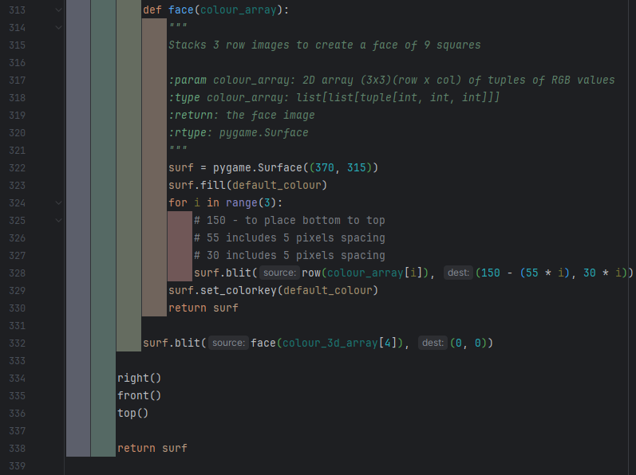

  

#### Features

The features move from the old cube file to this file remain largely the same, with only small changes to them to due to not being in the same file as the data structures. However, there are two new classes at the end of the file for displaying the game history and leaderboard.

 

The display history class manages getting the user’s game history and displaying it to the screen. The image it creates is scrollable.

The format_history function creates a 2D array, where the outer index is games, and the inner index is specific information. Only certain information has been taken from the user’s game history, and it all has been converted to a format the user will understand (e.g. time into hours, minutes, seconds) and then to a string that can be rendered.

I would have liked to make the time displayed include milliseconds, however the time library I had been using for times did not support this and I unfortunately did not have time to figure a way to implement this.

The get_image function uses the formatted list to create the image. It creates an image for each game that is just a rendered string and uses the get_height function and a variable to ensure the surf created is big enough, as the number of images being drawn to it is variable.

As the images are being created before the surf is, they are stored in a list, then iteratively blitted to the surf once it is created.

The update function doesn’t used validation, despite the fact it has a changing and thus non-validated screen position it blits to, as it is intended that the surf will be blitted offscreen if scrolled far enough.

The scroll function updates the y offset so that the image can be scrolled.

The leaderboard class manages creating and displaying the leaderboard. It contains another class that holds a single entry to the leaderboard, and that class also conforms to the specifications in the tools.File class that is being used to store the top ten scores, which includes having a unique, if meaningless id. Ideally the id would have some significance however its possible for multiple entries to be from the same user, or have the same time taken, or have the same number of moves done, so I had to create a separate variable for the id.

The entries are sorted after being obtained as the tools.File will store them according to their id, not their times.

The update list function manages checking new scores against the existing ones and adding or replacing scores if necessary. If the leaderboard isn’t full the solve is guaranteed to be added. When this is done the entry is given the id equal to the length entries list as this id cannot exist yet unless an entry is deleted without another being added, which shouldn’t happen.

If the slowest entry is quicker than or equal to the solve being checked the function exits as the entries aren’t going to changed. This is \<= as if two solves have taken the same amount of time I believe the solve done first should be the one to stay, if there not going to both be on the leaderboard. As this is checking against the slowest entry, only one of them can be on the leaderboard.

The final elif could have been an else, but I used an elif to make it clear when this will execute. It creates a new entry to replace the slowest one. It uses the same id as entry its replacing to ensure the list doesn’t end up with duplicate ids.

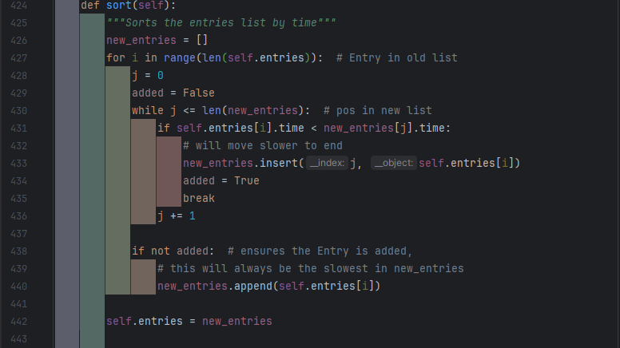

To sort the list I had originally created the above insertion sort style code, however I then realised the built-in sort function could be passed a keyword argument ‘key’ which would allow me to use it to sort by the time attribute of the entry classes. As this is more efficient than my function I used this instead, although I placed it within my sort function so I did not have to replace any of the self.sort calls.

The get_image function works similar to the DisplayHistory’s get_image method, but it isn’t scrollable, and values used are different.

#### Game Data

The game_data file exists to hold and manage global data.

 

I decided to make a class for the move stack so I could ensure that any moves added do have the correct structure. As such, the docstring specifies the two acceptable dictionary format and checks the given parameter matches one of these, and raises an error if it doesn’t.

The stack also contains some basic stack functions.

#### Interface

The only changes to the interface file were minor docstring edits on lines 37, 73, 75, 165, 166.

#### User Data

The user data file was created to manage storing a user’s data, including creating a list of their game history.

As the .__dict_\_ method is used the names, order, and amount of attributes cannot be changed without risking breaking things. This is not a good thing to do but it does greatly simplify the add function later on.

The aforementioned add function – it sets it attributes to the value of their respective variable in game_data, effectively updating them. Then they are added to the history list. Instead of manually creating the list of data to add to the history_list, I have used self.__dict__.values() to obtain the values of the attributes, then converted it to a list. This includes the history_list attribute itself, so that is remove by restricting the list to everything but its last value (history_list) with [:-1]. This means even changing the order of attributes would break things but, as I am the only one working on this project, and as adding or removing any variables would cause problems anyway unless every user’s history is wiped, I do not think it is too severe an issue.

The user class is designed to work with the tools.File class which also uses the \__dict_\_ method that history does, so it works very similarly.

The manager class serves to encapsulate the functions used for saving and loading data. It handles using the tools.File class as well as the User class to load and save data. The load function uses a try except statement to check if a user exists and create an account for them if they don’t.

#### Tools

When developing the save feature, I realised I needed a way to save users to a file, and be able to retrieve that specific user. As I have had to do something similar on multiple projects, I decided to make a general solution that can work for saving to any file. I also decided to put this in a tools file, something I am going to continue developing so I can use it on any project where it may help.

I created a custom exception to raise in case an object being searched for is not found. The exception gives the identifier that couldn’t be found, and the name of the file being looked in.

As this is a general purpose class, I have provided many methods. Some of these may cause issues if used together, as they update the data in different ways and thus could end up overwriting each other, so I have noted in the class’s documentation to not do that.

If the file that is too be used for saving doesn’t already exist, the class will handle creating it.

As the file stores classes where the first attribute is the identifier, the identifier can be obtained by getting the data associated with the first key in the classes dictionary.

To recreate the classes from the stored dictionaries, each line of the file is iterated through. Each line is read as a whole as a string and evaluated, which converts it back into a dictionary. The dictionary is then given to the class to be reconstructed as a set of keyword arguments, where the keys of the dictionary are the keywords. As the dictionary is in order of the class’s arguments this works the same as \*(eval(obj).values()), which would get the values of the keys of the dictionary and pass them as many arguments – instead of keywords and arguments.

I originally found the out about the eval function from [this](https://stackoverflow.com/a/988249) stack overflow comment, and when I then went looking into how I could use the dictionary I found [this](https://stackoverflow.com/a/334666).

I had originally used a merge sort to sort the list based on its identifier, but after learning I could use the .sort method with a key whilst developing the leaderboard, I switched it to using that instead.

I used a binary search for the search function as it is easy to code and efficient. The pos variable tracks the what position the start of the current sub-list is in the main self.list, as this means when a position is returned it is the useful and meaningful position of the searched item in the accessible self.list.

The save function works by ensuring the list is sorted then overwriting the file with it, where it writes the dictionary of the class in the list, one dictionary/class per line.

As I do not have tests for this file, I did some smalls tests at the end of the file, using line 229 to ensure the tests do not execute when the file is imported.

### Testing

| 29 | Save – to file | The save algorithm should be able to save all the key data to a text file. | Use the save function with a variety of different key information, including extreme test data such as the timer being at 0.0 seconds and the cube already being solved.  In each case attempt loading the program with this saved data, ensuring it is loaded as current game data. | The save file should be updated to include the key data for the user. | Fail |
|----|----------------|----------------------------------------------------------------------------|--------------------------------------------------------------------------------------------------------------------------------------------------------------------------------------------------------------------------------------------------------------------------------------|-----------------------------------------------------------------------|------|

The first issue I encountered, before even being able to use my tests, is a user not being found when the Manager.save function is run. This shouldn’t be an issue as the Manager.load function should have run before the save function ever could, and it was designed to create a user if didn’t exist. After investigating, I found that the problem was as simple as me never actually adding the created user to the File class.

Fixed by

| Test No. | What is being tested                   | Description                                                                                                                                                                                          | Method                                                                                                                                                                                                                                                                               | Expected Output                                                                                                                             | Pass/Fail |
|----------|----------------------------------------|------------------------------------------------------------------------------------------------------------------------------------------------------------------------------------------------------|--------------------------------------------------------------------------------------------------------------------------------------------------------------------------------------------------------------------------------------------------------------------------------------|---------------------------------------------------------------------------------------------------------------------------------------------|-----------|
| 1        | 3D cube algorithm                      | There should be an image algorithm that either returns a pygame.Surface containing an image of the cube, the cube to the screen.                                                                     | Blit the image returned by the function to the screen or call the function, inside the main game loop.  Repeat whilst making changes to used_cube.                                                                                                                                   | An image should be and it should match used_cube.                                                                                           | Pass      |
| 2        | Cube turn – vertical, left, up         | Executing the turns function with the correct parameters for the given turn should result in the leftmost column being rotated upwards.                                                              | Execute the turns function with the parameters for the turn. Run the cube display, the display should show the new cube state. The same rotation should be done to a real Rubik’s cube.                                                                                              | The image of both cubes should be exactly the same.                                                                                         | Pass      |
| 3        | Cube turns – vertical, middle, up      | Executing the turns function with the correct parameters for the given turn should result in the middle column being rotated upwards.                                                                |                                                                                                                                                                                                                                                                                      |                                                                                                                                             | Pass      |
| 4        | Cube turns – vertical, right, up       | Executing the turns function with the correct parameters for the given turn should result in the rightmost column being rotated upwards.                                                             |                                                                                                                                                                                                                                                                                      |                                                                                                                                             | Pass      |
| 5        | Cube turns – vertical, left, down      | Executing the turns function with the correct parameters for the given turn should result in the leftmost column being rotated downwards.                                                            |                                                                                                                                                                                                                                                                                      |                                                                                                                                             | Pass      |
| 6        | Cube turns – vertical, middle, down    | Executing the turns function with the correct parameters for the given turn should result in the middle column being rotated downwards.                                                              |                                                                                                                                                                                                                                                                                      |                                                                                                                                             | Pass      |
| 7        | Cube turns – vertical, right, down     | Executing the turns function with the correct parameters for the given turn should result in the rightmost column being rotated downwards.                                                           |                                                                                                                                                                                                                                                                                      |                                                                                                                                             | Pass      |
| 8        | Cube turns – horizontal, top, right    | Executing the turns function with the correct parameters for the given turn should result in the upper row being rotated right.                                                                      |                                                                                                                                                                                                                                                                                      |                                                                                                                                             | Pass      |
| 9        | Cube turns – horizontal, middle, right | Executing the turns function with the correct parameters for the given turn should result in the middle row being rotated right.                                                                     |                                                                                                                                                                                                                                                                                      |                                                                                                                                             | Pass      |
| 10       | Cube turns – horizontal, bottom, right | Executing the turns function with the correct parameters for the given turn should result in the lower row being rotated right.                                                                      |                                                                                                                                                                                                                                                                                      |                                                                                                                                             | Pass      |
| 11       | Cube turns – horizontal, top, left     | Executing the turns function with the correct parameters for the given turn should result in the upper row being rotated left.                                                                       |                                                                                                                                                                                                                                                                                      |                                                                                                                                             | Pass      |
| 12       | Cube turns – horizontal, middle, left  | Executing the turns function with the correct parameters for the given turn should result in the middle row being rotated left.                                                                      |                                                                                                                                                                                                                                                                                      |                                                                                                                                             | Pass      |
| 13       | Cube turns – horizontal, bottom, left  | Executing the turns function with the correct parameters for the given turn should result in the lower row being rotated left.                                                                       |                                                                                                                                                                                                                                                                                      |                                                                                                                                             | Pass      |
| 14       | Scramble                               | The scramble function should randomly position the individual squares whilst still ensuring that the cube is solvable.                                                                               | Add a delay between each move in the scramble function. Run the scramble function and follow along with a real Rubik’s cube.                                                                                                                                                         | Each move done by the scrambler should be possible on the real Rubik’s cube.                                                                | Pass      |
| 15       | Solver - solving                       | The solve function should solve the cube, showing the user each step, ensuring that each move is possible and not simply changing the used_cube to fit as needed.                                    | Manually scramble the cube, doing each move to a real Rubik’s cube as well. Run the solver and follow the moves on the Real Rubik’s cube.                                                                                                                                            | Each move done by the solver should be possible on the real Rubik’s cube and at the end the cube should be solved.                          | Fail      |
| 16       | Solver – stop solving                  | If used_cube reaches a solved state, the solver should stop solving, regardless of if there something such as a moves list indicates there are more moves to do to solve the cube.                   | Manually scramble the cube, ensuring that you return to a solved state at least once then scramble from there. Run the solver.                                                                                                                                                       | The solver should stop when it reaches the first solved state.                                                                              | Pass      |
| 17       | Check solved                           | There should be a function to check if a cube state is solved or not.                                                                                                                                | Test the function using multiple different cube states, some of which are manually or automatically scrambled.                                                                                                                                                                       | The outputs should match the given cube state.                                                                                              | Pass      |
| 18       | Hints                                  | The hint function should complete one move towards the solve. It must only be one and it must help solve the cube.                                                                                   | Scramble the cube then run the runt the hint function. Note the move that it makes. Undo that move and then run the solver (test 15 must have passed).                                                                                                                               | Only one move should be completed by the hint function. The move should match the one done by the solver.                                   | Fail      |
| 19       | Timer – time elapsed                   | The timer should correctly record the amount of timer that has passed since it started                                                                                                               | Start the timer. Wait for 10 seconds (counted via a trusted, real, timer). Print the time elapsed.  Repeat a few times with various amounts of time waited.                                                                                                                          | The trusted timer and the timer being tested should have a matching (or very similar, to account for human error) times.                    | Pass      |
| 20       | Timer – auto start                     | The timer should automatically start upon scramble.                                                                                                                                                  | Scramble the cube. Solve the cube. Scramble the cube, use hint function. Scramble the cube. Use the solve function. Scramble the cube.  Monitor the time elapsed during this.                                                                                                        | Each time the cube is scrambled the timer should start,                                                                                     | Pass      |
| 21       | Timer – auto stop                      | The timer should automatically stop upon being solved.                                                                                                                                               |                                                                                                                                                                                                                                                                                      | Upon being solved and when the solver is used, the timer should stop. The timer should not stop if these do not occur.                      | Fail      |
| 22       | Leaderboard – Eligibility check        | Each entry should be checked to see if they are faster than the slowest time on the leaderboard, to see if they have made it onto the leaderboard.                                                   | Submit a completion with a slower completion time than the slowest. Submit a completion with a faster time than the slowest. Submit a completion time identical to the slowest.                                                                                                      | Only the completion with the faster time should be considered for updating the leaderboard.                                                 | Pass      |
| 23       | Leaderboard – add entry                | If the leaderboard isn’t full any completion should be added to the leaderboard. If the leaderboard if full and entry is eligible, the new entry should replace the slowest time on the leaderboard. | Add an entry when the leaderboard is empty. Add an entry when the leaderboard is half full. Add an entry when the leaderboard is full.                                                                                                                                               | The first two entries should be automatically added to the leaderboard. The last entry should replace the slowest entry on the leaderboard. | Pass      |
| 24       | Leaderboard – sort leaderboard         | When a new completion is added to the leaderboard, the leaderboard needs to be sorted to ensure that completion ends up in the correct position. The list should be ordered by ascending times.      | Sort the leaderboard when it is already in order. Sort the leaderboard when it is in descending order. Sort the leaderboard when it is randomised. Sort the leaderboard when 2 identical times exist.                                                                                | Each leaderboard should end up sorted. Manually check this.                                                                                 | Pass      |
| 25       | Leaderboard – save times               | The ordered list of leaderboard times should be able to be saved to a text file so that they are kept even when the program ends.                                                                    | Save the leaderboard when it is empty. Save the leaderboard when it has no completions. Save the leaderboard when it is half full. Save the leaderboard when it is full.  In each case close the program and start it again, attempting to load these saves.                         | In each case the text file should be updated with the leaderboard.                                                                          | Pass      |
| 26       | Leaderboard – load saved times         | The saved leaderboard times need to be able to be loaded so they can be displayed and be checked against for any new records.                                                                        |                                                                                                                                                                                                                                                                                      | In each case the leaderboard should be updated to match the text file.                                                                      | Pass      |
| 27       | Guide algorithm                        | The should either be a function that returns a pygame.Surface or a procedure that draws the image to the screen.   The image should show how to use the cube.                                        | Either blit the pygame.Surface to the screen or call the procedure inside a game loop.                                                                                                                                                                                               | An image should be displayed.                                                                                                               | Pass      |
| 28       | Guide algorithm – prevent moves        | The cube image should only display the default cube and as such it should not allow cube interactions to happen when the guide is being displayed.                                                   | When displaying the cube, try the following: turns, rotations, scrambling and solving.                                                                                                                                                                                               | None of the functions should work. The cube should remain unchanged.                                                                        | Pass      |
| 30       | Save – load form file                  | The save algorithm should be manage loading the data from the text file and updating game values so it is as if the saved state has been achieved in the current session.                            | Use the save function with a variety of different key information, including extreme test data such as the timer being at 0.0 seconds and the cube already being solved.  In each case attempt loading the program with this saved data, ensuring it is loaded as current game data. | The save file should be updated to include the key data for the user.                                                                       | Fail      |
| 31       | Save – autosave                        | The save function should automatically run periodically.                                                                                                                                             | Start a game and make some changes to the cube. Then wait the amount of time set between saves. Once this time has passed closer and reopen the program.                                                                                                                             | The cube should be in the same state as it was when the program was closed,                                                                 | Pass      |
| 32       | Game history                           | When a solve is complete, either by the solve function being used, the scrambler being used, or the cube being solved, the data about that solve should be saved to a list of solves.                | Finish a solve using the solver, scrambler, and by solving manually.                                                                                                                                                                                                                 | These three solves should be added to game history list.                                                                                    | Pass      |

### Improvements

Tests 15 and 18 – Both the solver and hint feature work if the scramble function is used once, and then the cube solved. However, if the scramble feature is used more than once the solver and hint feature seems to have a limit for how much of the cube they can solve.

Both these features share the function Solver.pop_move, so I investigated that function. I could find no errors with it, so I knew it had something to do with game_data.moves stack. As the problem occurred when the scramble function was called, I checked when the function was called in the game loop.

The problem was then immediately obvious, the moves list was being cleared each time the scramble function was called, and the move_count set to 0, but the moves themselves where still done and needed to be know so the solver can undo them.

I chose to fix this by making the scramble function reset the cube to default before scrambling it, which ensures this error won’t occur again.

Original:

Fixed:

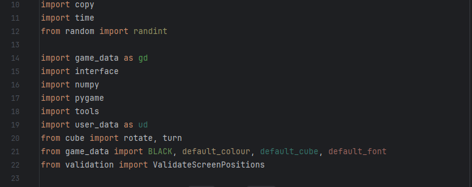

Tests 21 and 30 – The issue was that the timer function sometimes stopped automatically, and sometimes it continued when the cube was solved. I quickly determined that the Solver.check_solved() function was the problem, as it returned False even when the cube was solved. However, when checking the function, everything appeared to be in order.

However, in the saves_data.txt file, the cube state had an interesting anomaly. Some of the colours were being saved as tuples, whilst some were saved as lists. The save files was also being broken and has ‘array’ for it for some reason. This broken file format had been preventing me from loading saves, however I had simply been deleting the save file (so a new one was created, which worked) before starting the program each time, as I was focusing on the this (and previous) errors, waiting to fix the loading error until I reached the save test.

Unfortunately, I still had little idea what could be causing this, so I decided to test each possible turn one by one. I found only edge turns resulted in this, but middle turns did not. This did help, as I knew the main coding difference between middle turns and edge turns was that edge turns involved using numpy.rot90 on the face the edge touched. After checking, I found that numpy.rot90 did return an array like I expected, but instead an ndarray. I fixed this by using .tolist(), a method of ndarrays which returns them as a normal list. I made sure to include this for the z axis rotation as well.

Original:

Fixed:

This fixed my saving issue, but still prevented check_sorted from working, as some tuples were still becoming lists. I could have created a small function to check to convert the RGB lists back into tuples, but this function would have had to be called every time check_solved was run, and any other function that relied on the colours being a consistent data type, so I instead decided to get rid of the tuples completely and just use lists. To do this I just converted the colours in game_data from tuples to lists.

Original Fixed

 

This finally fixed the problem.

### Program Images

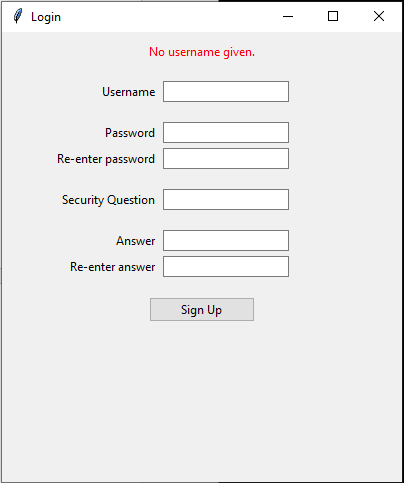

 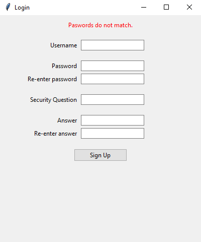      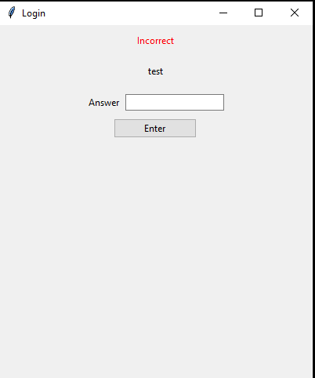 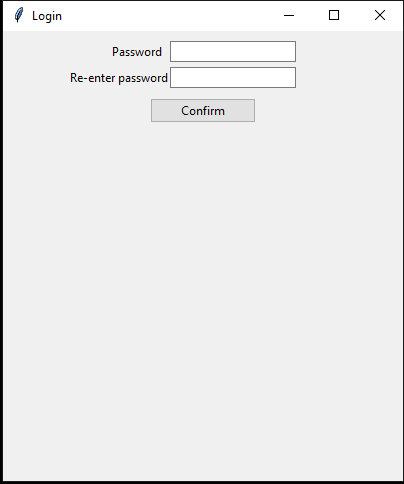            

# Evaluation

## Post-development testing

### Stakeholder Responses

| Stakeholder name: | Sam Flegg                                                                                                       |             |                    |
|-------------------|-----------------------------------------------------------------------------------------------------------------|-------------|--------------------|
| Test no.          | Question                                                                                                        | Answer type | Stakeholder Answer |
| 33                | Is there a representation of a 3D cube?                                                                         | Yes or No   | Yes                |
| 34                | How professional does the 3D cube look?                                                                         | 1 to 10     | 8                  |
| 35                | To your knowledge, is every move that’s possible on a real Rubik’s cube possible on the program’s Rubik’s cube? | Yes or No   | Yes                |
| 35                | To your knowledge, is every move possible on the program possible on a real Rubik’s cube?                       |             | Yes                |
| 37                | How well do the cube controls meet the description: simple and intuitive?                                       | 1 to 10     | 10                 |
| 38                | How well do he program controls meet the description: simple and intuitive?                                     |             | 10                 |
| 39                | Is there a scramble function?                                                                                   | Yes or No   | Yes                |
| 40                | Is there a solve function?                                                                                      |             | Yes                |
| 41                | How well does the solve function show each move done (in regards to you being able to understand it)?           | 1 to 10     | 6                  |
| 42                | Is there a hint function that shows you the next move to make?                                                  | Yes or No   | Yes                |
| 43                | Is there a timer to track how long solves take?                                                                 |             | Yes                |
| 44                | Does the timer start automatically?                                                                             |             | Yes                |
| 45                | Does the timer stop automatically?                                                                              |             | Yes                |
| 46                | Is there a leaderboard?                                                                                         |             | Yes                |
| 47                | Does the leaderboard show the ten quickest solves in ascending order?                                           |             | Yes                |
| 48                | Does each leaderboard entry display: the username, the time taken, the moves taken?                             |             | Yes                |
| 49                | Is there a login system?                                                                                        |             | Yes                |
| 50                | How straightforward to use is the login system?                                                                 | 1 to 10     | 9                  |
| 51                | Is your user and game data loaded when you log in?                                                              | Yes or No   | Yes                |
| 52                | Does the save function run automatically?                                                                       |             | Yes                |
| 53                | Is there a guide to use the program?                                                                            |             | Yes                |
| 54                | How clear and concise is the guide?                                                                             | 1 to 10     | 10                 |
| 55                | Is there a function to see your game history?                                                                   | Yes or No   | Yes                |
| 56                | How easy does the game history function make it to see how you have progressed?                                 | 1 to 10     | 8                  |

| Stakeholder name: | Eddie Coulson                                                                                                   |             |                    |
|-------------------|-----------------------------------------------------------------------------------------------------------------|-------------|--------------------|
| Test no.          | Question                                                                                                        | Answer type | Stakeholder Answer |
| 33                | Is there a representation of a 3D cube?                                                                         | Yes or No   | Yes                |
| 34                | How professional does the 3D cube look?                                                                         | 1 to 10     | 10                 |
| 35                | To your knowledge, is every move that’s possible on a real Rubik’s cube possible on the program’s Rubik’s cube? | Yes or No   | Yes                |
| 35                | To your knowledge, is every move possible on the program possible on a real Rubik’s cube?                       |             | Yes                |
| 37                | How well do the cube controls meet the description: simple and intuitive?                                       | 1 to 10     | 10                 |
| 38                | How well do he program controls meet the description: simple and intuitive?                                     |             | 8                  |
| 39                | Is there a scramble function?                                                                                   | Yes or No   | Yes                |
| 40                | Is there a solve function?                                                                                      |             | Yes                |
| 41                | How well does the solve function show each move done (in regards to you being able to understand it)?           | 1 to 10     | 5                  |
| 42                | Is there a hint function that shows you the next move to make?                                                  | Yes or No   | Yes                |
| 43                | Is there a timer to track how long solves take?                                                                 |             | Yes                |
| 44                | Does the timer start automatically?                                                                             |             | Yes                |
| 45                | Does the timer stop automatically?                                                                              |             | Yes                |
| 46                | Is there a leaderboard?                                                                                         |             | Yes                |
| 47                | Does the leaderboard show the ten quickest solves in ascending order?                                           |             | Yes                |
| 48                | Does each leaderboard entry display: the username, the time taken, the moves taken?                             |             | Yes                |
| 49                | Is there a login system?                                                                                        |             | Yes                |
| 50                | How straightforward to use is the login system?                                                                 | 1 to 10     | 10                 |
| 51                | Is your user and game data loaded when you log in?                                                              | Yes or No   | Yes                |
| 52                | Does the save function run automatically?                                                                       |             | Yes                |
| 53                | Is there a guide to use the program?                                                                            |             | Yes                |
| 54                | How clear and concise is the guide?                                                                             | 1 to 10     | 7                  |
| 55                | Is there a function to see your game history?                                                                   | Yes or No   | Yes                |
| 56                | How easy does the game history function make it to see how you have progressed?                                 | 1 to 10     | 9                  |

| Stakeholder name: | Connor Gilroy                                                                                                   |             |                    |
|-------------------|-----------------------------------------------------------------------------------------------------------------|-------------|--------------------|
| Test no.          | Question                                                                                                        | Answer type | Stakeholder Answer |
| 33                | Is there a representation of a 3D cube?                                                                         | Yes or No   | Yes                |
| 34                | How professional does the 3D cube look?                                                                         | 1 to 10     | 7                  |
| 35                | To your knowledge, is every move that’s possible on a real Rubik’s cube possible on the program’s Rubik’s cube? | Yes or No   | Yes                |
| 35                | To your knowledge, is every move possible on the program possible on a real Rubik’s cube?                       |             | Yes                |
| 37                | How well do the cube controls meet the description: simple and intuitive?                                       | 1 to 10     | 6                  |
| 38                | How well do he program controls meet the description: simple and intuitive?                                     |             | 6                  |
| 39                | Is there a scramble function?                                                                                   | Yes or No   | Yes                |
| 40                | Is there a solve function?                                                                                      |             | Yes                |
| 41                | How well does the solve function show each move done (in regards to you being able to understand it)?           | 1 to 10     | 5                  |
| 42                | Is there a hint function that shows you the next move to make?                                                  | Yes or No   | Yes                |
| 43                | Is there a timer to track how long solves take?                                                                 |             | Yes                |
| 44                | Does the timer start automatically?                                                                             |             | Yes                |
| 45                | Does the timer stop automatically?                                                                              |             | Yes                |
| 46                | Is there a leaderboard?                                                                                         |             | Yes                |
| 47                | Does the leaderboard show the ten quickest solves in ascending order?                                           |             | Yes                |
| 48                | Does each leaderboard entry display: the username, the time taken, the moves taken?                             |             | Yes                |
| 49                | Is there a login system?                                                                                        |             | Yes                |
| 50                | How straightforward to use is the login system?                                                                 | 1 to 10     | 7                  |
| 51                | Is your user and game data loaded when you log in?                                                              | Yes or No   | Yes                |
| 52                | Does the save function run automatically?                                                                       |             | Yes                |
| 53                | Is there a guide to use the program?                                                                            |             | Yes                |
| 54                | How clear and concise is the guide?                                                                             | 1 to 10     | 7                  |
| 55                | Is there a function to see your game history?                                                                   | Yes or No   | Yes                |
| 56                | How easy does the game history function make it to see how you have progressed?                                 | 1 to 10     | 4                  |
| Stakeholder name: | James Brearly                                                                                                   |             |                    |
| Test no.          | Question                                                                                                        | Answer type | Stakeholder Answer |
| 33                | Is there a representation of a 3D cube?                                                                         | Yes or No   | Yes                |
| 34                | How professional does the 3D cube look?                                                                         | 1 to 10     | 9                  |
| 35                | To your knowledge, is every move that’s possible on a real Rubik’s cube possible on the program’s Rubik’s cube? | Yes or No   | Yes                |
| 35                | To your knowledge, is every move possible on the program possible on a real Rubik’s cube?                       |             | Yes                |
| 37                | How well do the cube controls meet the description: simple and intuitive?                                       | 1 to 10     | 6                  |
| 38                | How well do he program controls meet the description: simple and intuitive?                                     |             | 8                  |
| 39                | Is there a scramble function?                                                                                   | Yes or No   | Yes                |
| 40                | Is there a solve function?                                                                                      |             | Yes                |
| 41                | How well does the solve function show each move done (in regards to you being able to understand it)?           | 1 to 10     | 4                  |
| 42                | Is there a hint function that shows you the next move to make?                                                  | Yes or No   | Yes                |
| 43                | Is there a timer to track how long solves take?                                                                 |             | Yes                |
| 44                | Does the timer start automatically?                                                                             |             | Yes                |
| 45                | Does the timer stop automatically?                                                                              |             | Yes                |
| 46                | Is there a leaderboard?                                                                                         |             | Yes                |
| 47                | Does the leaderboard show the ten quickest solves in ascending order?                                           |             | Yes                |
| 48                | Does each leaderboard entry display: the username, the time taken, the moves taken?                             |             | Yes                |
| 49                | Is there a login system?                                                                                        |             | Yes                |
| 50                | How straightforward to use is the login system?                                                                 | 1 to 10     | 8                  |
| 51                | Is your user and game data loaded when you log in?                                                              | Yes or No   | Yes                |
| 52                | Does the save function run automatically?                                                                       |             | Yes                |
| 53                | Is there a guide to use the program?                                                                            |             | Yes                |
| 54                | How clear and concise is the guide?                                                                             | 1 to 10     | 5                  |
| 55                | Is there a function to see your game history?                                                                   | Yes or No   | Yes                |
| 56                | How easy does the game history function make it to see how you have progressed?                                 | 1 to 10     | 6                  |

| Stakeholder name: | Jake Elmer                                                                                                      |             |                    |
|-------------------|-----------------------------------------------------------------------------------------------------------------|-------------|--------------------|
| Test no.          | Question                                                                                                        | Answer type | Stakeholder Answer |
| 33                | Is there a representation of a 3D cube?                                                                         | Yes or No   | Yes                |
| 34                | How professional does the 3D cube look?                                                                         | 1 to 10     | 7                  |
| 35                | To your knowledge, is every move that’s possible on a real Rubik’s cube possible on the program’s Rubik’s cube? | Yes or No   | Yes                |
| 35                | To your knowledge, is every move possible on the program possible on a real Rubik’s cube?                       |             | Yes                |
| 37                | How well do the cube controls meet the description: simple and intuitive?                                       | 1 to 10     | 6                  |
| 38                | How well do he program controls meet the description: simple and intuitive?                                     |             | 6                  |
| 39                | Is there a scramble function?                                                                                   | Yes or No   | Yes                |
| 40                | Is there a solve function?                                                                                      |             | Yes                |
| 41                | How well does the solve function show each move done (in regards to you being able to understand it)?           | 1 to 10     | 6                  |
| 42                | Is there a hint function that shows you the next move to make?                                                  | Yes or No   | Yes                |
| 43                | Is there a timer to track how long solves take?                                                                 |             | Yes                |
| 44                | Does the timer start automatically?                                                                             |             | Yes                |
| 45                | Does the timer stop automatically?                                                                              |             | Yes                |
| 46                | Is there a leaderboard?                                                                                         |             | Yes                |
| 47                | Does the leaderboard show the ten quickest solves in ascending order?                                           |             | Yes                |
| 48                | Does each leaderboard entry display: the username, the time taken, the moves taken?                             |             | Yes                |
| 49                | Is there a login system?                                                                                        |             | Yes                |
| 50                | How straightforward to use is the login system?                                                                 | 1 to 10     | 9                  |
| 51                | Is your user and game data loaded when you log in?                                                              | Yes or No   | Yes                |
| 52                | Does the save function run automatically?                                                                       |             | Yes                |
| 53                | Is there a guide to use the program?                                                                            |             | Yes                |
| 54                | How clear and concise is the guide?                                                                             | 1 to 10     | 6                  |
| 55                | Is there a function to see your game history?                                                                   | Yes or No   | Yes                |
| 56                | How easy does the game history function make it to see how you have progressed?                                 | 1 to 10     | 6                  |

### Results

| Test No. | What is being tested             | Type                  | Description                                                                                      | Pass criteria                     | Stakeholder responses.      | Pass / Fail |
|----------|----------------------------------|-----------------------|--------------------------------------------------------------------------------------------------|-----------------------------------|-----------------------------|-------------|
| 33       | 3D cube – image.                 | Function              | There is a 3D representation of a cube.                                                          | All stakeholders must answer yes  | Yes / Yes / Yes / Yes / Yes | Pass        |
| 34       | 3D cube - professionalism        | Useability            | The 3D cube must look professional.                                                              | Avg. score \>= 70%                | 82%                         | Pass        |
| 35       | Logic – possible states.         | Function              | It must be possible to reach every possible cube state.                                          | All stakeholders must answer yes. | Yes / Yes / Yes / Yes / Yes | Pass        |
| 36       | Logic – possible moves.          | Function / Robustness | All moves able to be done to the cube must be possible on a real Rubik’s cube.                   |                                   | Yes / Yes / Yes / Yes / Yes | Pass        |
| 37       | Controls - cube.                 | Useability            | The controls for interacting with the cube must be simple and intuitive.                         | Avg. score \>= 70%                | 76%                         | Pass        |
| 38       | Controls – program.              | Useability            | The controls for interacting with the program must be simple and intuitive.                      |                                   | 76%                         | Pass        |
| 39       | Scramble.                        | Function              | There must be scramble function to scramble the cube.                                            | All stakeholders must answer yes. | Yes / Yes / Yes / Yes / Yes | Pass        |
| 40       | Solver – solves cube.            | Function              | There must be a solve function that solves the cube.                                             |                                   | Yes / Yes / Yes / Yes / Yes | Pass        |
| 41       | Solver – showcase moves.         | Function, Useability  | The solve function must show each move being done to solve the cube in an understandable manner. | Avg. score \>= 70%                | 52%                         | Fail        |
| 42       | Hints.                           | Function              | A hint feature should show the user the next move to make.                                       | All stakeholders must answer yes. | Yes / Yes / Yes / Yes / Yes | Pass        |
| 43       | Timer – timing.                  | Function              | A timer should be available to time solves.                                                      |                                   | Yes / Yes / Yes / Yes / Yes | Pass        |
| 44       | Timer – auto start.              | Useability            | The timer automatically starts.                                                                  |                                   | Yes / Yes / Yes / Yes / Yes | Pass        |
| 45       | Timer – auto stop.               | Useability            | The timer automatically stops.                                                                   |                                   | Yes / Yes / Yes / Yes / Yes | Pass        |
| 46       | Leaderboard – image.             | Function              | There is a leaderboard.                                                                          |                                   | Yes / Yes / Yes / Yes / Yes | Pass        |
| 47       | Leaderboard – solves.            | Function              | The leaderboard should display the ten quickest solve times or more, in ascending order.         |                                   | Yes / Yes / Yes / Yes / Yes | Pass        |
| 48       | Leaderboard – details.           | Function              | Each entry must display: username, the number of moves required, the time taken.                 |                                   | Yes / Yes / Yes / Yes / Yes | Pass        |
| 49       | Login System – logs in.          | Function              | There should be a login system that allows users to login in.                                    |                                   | Yes / Yes / Yes / Yes / Yes | Pass        |
| 50       | Login System – straightforward.  | Useability            | The login system should be straightforward and easy to use.                                      | Avg. score \>= 70%                | 86%                         | Pass        |
| 51       | Save – loading.                  | Function              | Upon logging in user data should be loaded.                                                      | All stakeholders must answer yes. | Yes / Yes / Yes / Yes / Yes | Pass        |
| 52       | Save – automatic.                | Useability            | The save function should run automatically.                                                      |                                   | Yes / Yes / Yes / Yes / Yes | Pass        |
| 53       | Guide – exists.                  | Function              | There must be a guide that shows how to use the program.                                         |                                   | Yes / Yes / Yes / Yes / Yes | Pass        |
| 54       | Guide – user display.            | Useability            | The guide must be clear and concise.                                                             | Avg. score \>= 70%                | 70%                         | Pass        |
| 55       | Game history – exists.           | Function              | There must be a game history function that displays previous game history.                       | All stakeholders must answer yes. | Yes / Yes / Yes / Yes / Yes | Pass        |
| 56       | Game history – usefulness.       | Useability            | The game history function must make it easy to see how you have progressed over time.            | Avg. score \>= 70%                | 66%                         | Fail        |

## Success Criteria

| No. | Criteria                                                                                                                                                                                                                                                                   | Associated Tests | Pass / Partial / Fail |
|-----|----------------------------------------------------------------------------------------------------------------------------------------------------------------------------------------------------------------------------------------------------------------------------|------------------|-----------------------|
| 1   | There should be a professional looking visual representation of a 3-dimesional Rubik’s cube as this is the core of the program and a non-standard cube layout (e.g. a net) may confuse users.                                                                              | 1, 33, 34        | Pass                  |
| 2   | The cube should have the correct logic - the result of any moves should match the result of performing the move on a real Rubik’s cube.                                                                                                                                    | 2-13, 35, 36     | Pass                  |
| 3   | There should be a scramble feature able to produce a scramble for the user to solve. The scramble must be possible to solve.                                                                                                                                               | 14, 39           | Pass                  |
| 4   | A solver feature should be included. This should be able to solve the cube move by move, allowing the user to see the steps required to solve it so they may learn from it.                                                                                                | 15-17, 40, 41    | Partial               |
| 5   | A hint feature should tell the user the next move they should make if they require help, as to decrease the chance that the user simply gives up.                                                                                                                          | 18, 42           | Pass                  |
| 6   | A timer function should be included to incentivise competitiveness. In line with this the timer must be as easy to use as possible, it should not cause any delays. It will automatically start upon the user’s first move and automatically stop when the cube is solved. | 19-21, 43-45     | Pass                  |
| 7   | A local leaderboard will be included to allow people to compete. This should display, at a minimum: the ten quickest solve times, the respective usernames, and number of moves required.                                                                                  | 23-26, 46-48     | Pass                  |
| 8   | The leaderboard should only include solves that did not utilise the hint or solve functions.                                                                                                                                                                               | 22               | Pass                  |
| 9   | There should be a straightforward login system that utilises encryption and/or hashing for security.                                                                                                                                                                       | 49, 50           | Partial               |
| 10  | There should be a clear and concise guide to using the program to prevent any confusion.                                                                                                                                                                                   | 27, 28, 53, 54   | Pass                  |
| 11  | There should be a simple to use save function to allow users with limited time to play whenever they wish without worrying if they have enough time for a complete solve.                                                                                                  | 29, 30, 51       | Pass                  |
| 12  | The save function should be able to run automatically to prevent users from losing progress should they forgot to save or something unexpected happens – e.g. power loss.                                                                                                  | 31, 52           | Pass                  |
| 13  | A game history function should be included to allow users to see how they have progressed overtime.                                                                                                                                                                        | 32, 55, 56       | Partial               |

## Potential Improvements

### Success Criteria

#### Success Criteria 4

Success criteria 4 relates to the solver. Whilst the solver functions, test 41 failed. This is because the solver “must show each move being done to solve the cube in an understandable manner.” As the solver displays moves by simply doing them, it can be difficult to see the goal of the move. Additionally, as the time between each move is inversely proportional to the number of moves required, it can complete some solves too fast for people to see.

To fix this problem a new sub-feature could be added, with the purpose of displaying all the moves done by the solver in a written format, showing all the moves at the same time. This would allow users to analyse the moves being made and see their overall purpose.

#### Success Criteria 9

Success criteria 9 relates to the login function, and the aspect this improvement relates to is that states that the login system “utilises encryption and/or hashing for security.” Technically, this criterion has been met, however the purpose of the criteria is to ensure a high level of security. Despite the login function being treated as an unrelated module, I was the one to create it, and I know it only uses a simple Caesar cypher.

To fix this, the login could be updated to use a well-developed login library, or a new login system could be created, using a more secure encryption or hashing function.

#### Success Criteria 13

Success criteria 13 relates the game history function. The feature does function, however the failure of test 56 indicates that it is not easy to see your progress over time.

To fix this the display of the game history should be changed to a cleaner, easier to read, display. Additionally, metrics could also be displayed on graphs and charts, such as a line graph showing how the use’s solve time has varied over time.

### Limitations

#### 3D cube

Due to the significantly higher difficultly and associated time requirements of using and learning a 3D engine, I have not implemented a true 3D cube. This means that users cannot freely rotate the cube or see moves being made – they just instantly happen. Introducing a 3D cube would fix this.

To introduce a 3D cube whilst keeping the code limited to python an engine such as Panda3D could be used, or, if different languages can be sued, the more popular Unity or Godot engines would be good engines to use. To allow users to rotate the cube an interface method would need to be added. If the mouse if used this would be very easily as pygame supports mouse inputs, and this feature is already used in the program.

#### Multiple cubes

Originally, I believed that implementing multiple cubes would be very difficult and time consuming, and as such I did not implement them. This may reduce how appealing my program is to users, as anyone wanting to quickly try their hand at a more unique Rubik’s cube would have to use another program. Additionally, the niche of potentially users who mainly use unique cube types are completely lost.

Now that I am more familiar with the coding requirements, I do not believe this would be as hard to implement as I originally thought. A parent class should be created that is inherited by all the cube types to standardise the methods used to interact with them. Whilst any non-cube would need its own class, all cubes could be managed by one class with the only additional information required being the side length of the cube. The turns and rotations functions could easily be updated to support his, with only the fixed values such as 3 and 2 needing to be changed to side length and side length – 1 respectively. For example, changing this:

To this:

Should allow the turns function to work with any side_length\*side_length\*side_length cube, although this is untested.

#### Explained tips/hints

Due to my limited knowledge on solving Rubik’s cubes and the number of possible cube states, I did not implement hint explanations. This would be useful to help users improve, instead of simply doing the move for them.

Implementing this, however, would still be very difficult. The solver would need to be overhauled so that it follows an algorithm, such as he Advanced Fridrich (CFOP) algorithm, instead of undoing the moves that have already been done to the cube. This would break solving the cube down into 4 steps, and each move can be explained by how they help complete that step. The tip could either tell users the step it is helping to solve, or fully explain its purpose in solving that step. However, the latter option would require someone writing an explanation for every single move. Once this is done, the explanation can be displayed whenever the hint feature is used.

#### Online Leaderboard

I did not implement an online leaderboard as I do no have access to a server. However, an online leaderboard would allow for more competition between users as they could see other’s scores regardless of where they played, instead of each device having its own leaderboard.

The leaderboard could be shared across devices by making an API with Flask to allow the leaderboard to be accessed from anywhere online. This would require the leaderboard being redone to make it fetch the leaderboard from online instead of loading the file. By using things such an API key, this could also be made secure and therefore it would be harder for people to cheat. Currently, anyone can create any leaderboard entry they want by simply editing the leaderboard.txt file.

#### Mouse controls

I did not implement mouse controls as I was not sure how to stop them from being as clunky as they were in similar programs. Unfortunately, I still am unsure about how to prevent this. The corner positions of each square on the cube would need to be recorded, as well as the corner positions of the cube itself, to check where the user is trying to interact with. It would also need to be checked if the user is actively holding the left mouse button. The change in x and y position of the cursor would need to be recorded whilst the button is held will need to be measure. If this is going to be implemented more research will need to be done.

## Maintenance

Currently, whilst the program can be further developed, the unorganized file structure may make it confusing and errors more likely. To combat this, the files should be broken down and restructured. For example, the features.py file could be separated into a file for every feature, that all get stores in a features folder. The saves.txt file and the new save.py file cold themselves be bundled into a saves folder inside the feature folder.

# Appendix

## main.py

"""

This is the file to run to execute the program

This file handles the main loop of the program, it gets images and data from the other

files and displays them. It also handles user input within the game loop.

black, isort and flake8 used for formatting

"""

import sys

import time

import cube

import features

import game_data \# for changing variables in data file

import interface

import pygame

import user_data

from game_data import \*

from Login import login_window

from validation import ValidateScreenPositions

\# window

pygame.init()

width = 1600

height = 900

screen = pygame.display.set_mode((width, height), pygame.RESIZABLE)

pygame.display.set_caption("Rubik's Cube")

\# validation

val = ValidateScreenPositions(width, height)

\# cubes and visuals

cube_net = cube.CubeNet(screen, val.run((width // 2, height // 2)))

cube_3d = cube.Cube3D(screen, val.run((width // 2, height // 2)))

cube_guide = cube.CubeGuide(screen, val.run((width // 2, height // 2)))

display_history = features.DisplayHistory(screen, val.run((width // 2, height // 2)))

display_leaderboard = features.Leaderboard(screen, val.run((width // 2, height // 2)))

class Buttons:

"""

This class handles the rendering of the buttons

This class is largely self-contained, the only usage should be to run

.update as this automatically updates the buttons

"""

cube_option = interface.DisplayOption(

lambda: cube_3d.get_image(),

screen,

val.run([10, 0]),

[100, 100],

1.5,

lambda: Buttons.display_swap("3d"),

default_colour,

)

net_option = interface.DisplayOption(

lambda: cube_net.get_image(),

screen,

val.run([10, 100]),

[100, 100],

1.5,

lambda: Buttons.display_swap("net"),

default_colour,

)

guide_option = interface.DisplayOption(

lambda: cube_guide.get_image(),

screen,

val.run([10, 200]),

[100, 100],

1.5,

lambda: Buttons.display_swap("guide"),

BLACK,

) \# should be default colour,

\# but this causes the background of the hovered button to be black.

\# May be an error with pygame.smoothscale in interface file

\# this works as a solution

history_option = interface.DisplayOption(

lambda: interface.text(

"HISTORY",

default_font,

BLACK,

default_colour

),

screen,

val.run([10, 300]),

[100, 25],

1.5,

lambda: Buttons.display_swap("history"),

BLACK, \# same problem as guide

)

leaderboard_option = interface.DisplayOption(

lambda: interface.text(

"LEADERBOARD",

default_font,

BLACK,

default_colour

),

screen,

val.run([10, 325]),

[100, 25],

1.5,

lambda: Buttons.display_swap("leaderboard"),

BLACK, \# same problem as guide

)

cube_option_bar = interface.DisplayBar( \# update with any new options

[cube_option, net_option, guide_option, history_option, leaderboard_option],

False,

)

display_option = "3d"

@staticmethod

def display_swap(option):

"""

Updates display_option variable within the class

This provides a function for interface.DisplayOption objects

to update the display_option variable which is saved with this class

:param option: the new display_option: 3d, net, guide, history or leaderboard

:type option: str

"""

Buttons.display_option = option

@staticmethod

def update(mouse_pos, mouse_up):

"""

Updates each button in the class

:param mouse_pos: the x,y position of the mouse

:param mouse_up: whether the mouse button has been clicked

:type mouse_pos: tuple[int, int] or list[int, int]

:type mouse_up: bool

:rtype: None

"""

Buttons.cube_option_bar.update(mouse_pos, mouse_up)

\# used for solving the cube

solve_cube = False

"""If the cube is being solved

:type solve_cube: bool"""

solver = features.Solver()

timer = features.Timer()

last_save = time.time()

"""The timestamp of the last save, used for calculating time since last save

:type last_save: float"""

\# login

def load(username):

"""Desgined to be called by the login window, this function will load the users data

Uses Manager.load to load the users data and then checks the game state, updating

details about the timer and solver is nessesary

:param username: the unique username of the user

:type username: str

"""

user_data.Manager.load(username)

if game_data.time_taken \> 0: \# timer is running

\# manually start timer to avoid changing start time

timer.exists = True

timer.running = True

timer.start_time = (

time.time() - game_data.time_taken

) \# act as if timer has just started

if game_data.solver_used: \# solver is runnning

\# finish solving cube

solver.first = False

solve_cube = True

login_window.Window(lambda u: load(u))

\# game loop

while True:

mouse_pos = pygame.mouse.get_pos()

mouse_up = False

val.update_size(pygame.display.get_surface().get_size())

for event in pygame.event.get():

if event.type == pygame.QUIT:

pygame.quit()

sys.exit()

elif event.type == pygame.MOUSEBUTTONUP:

mouse_up = True

elif event.type == pygame.MOUSEWHEEL and Buttons.display_option == "history":

display_history.scroll(event.y \* 25)

\# prevent any moves made whilst on guide cube

elif event.type == pygame.KEYDOWN and Buttons.display_option != "guide":

\# row right

if event.key == pygame.K_t:

cube.turn(True, 0)

elif event.key == pygame.K_g:

cube.turn(True, 1)

elif event.key == pygame.K_b:

cube.turn(True, 2)

\# row left

elif event.key == pygame.K_r:

cube.turn(True, 0, True)

elif event.key == pygame.K_f:

cube.turn(True, 1, True)

elif event.key == pygame.K_v:

cube.turn(True, 2, True)

\# column up

elif event.key == pygame.K_q:

cube.turn(False, 0)

elif event.key == pygame.K_w:

cube.turn(False, 1)

elif event.key == pygame.K_e:

cube.turn(False, 2)

\# column down

elif event.key == pygame.K_a:

cube.turn(False, 0, True)

elif event.key == pygame.K_s:

cube.turn(False, 1, True)

elif event.key == pygame.K_d:

cube.turn(False, 2, True)

\# rotations

elif event.key == pygame.K_x:

cube.rotate("x")

elif event.key == pygame.K_y:

cube.rotate("y")

elif event.key == pygame.K_z:

cube.rotate("z")

elif event.key == pygame.K_k: \# solve

game_data.solver_used = True

if timer.running: \# ensures the attempt was started

\# failed attempts should be recorded

game_data.solved = False

user_data.game_history.add_game()

timer.delete()

solve_cube = True

elif event.key == pygame.K_m: \# scramble

if timer.running: \# ensures the attempt was started

\# failed attempts should be recorded

user_data.game_history.add_game()

\# reset key data

game_data.moves.clear()

game_data.move_count = 0

game_data.scrambler_count = 0

game_data.hints_used = False

game_data.solver_used = False

game_data.solved = False

game_data.time_taken = 0

game_data.start_time = time.time()

features.scramble()

\# prevent the timer from being started whilst the solver runs

\# was achieved by scrambling whilst the timer ran

solve_cube = False

timer.start() \# start timer

elif event.key == pygame.K_h: \# hint

game_data.hints_used = True

solver.pop_move()

screen.fill(default_colour) \# background colour

if solve_cube:

\# ensures each solve take 5 sections, assuming no hardware limitations

time.sleep(solver.sleep_time)

solve_cube = solver.solve() \# solves one move

else:

solver.first = True \# so next solve it is set to true

if timer.running and solver.check_solved(): \# on a solve

timer.stop()

game_data.solved = True

user_data.game_history.add_game()

display_leaderboard.update_list(

game_data.time_taken,

game_data.move_count

)

if Buttons.display_option == "3d":

display_cube = cube_3d

elif Buttons.display_option == "net":

display_cube = cube_net

elif Buttons.display_option == "guide":

\# also prevents cube interact as uses default

display_cube = cube_guide

\# actions text

screen.blit(

interface.text(

text="Scramble: M",

font=guide_font,

foreground_colour=BLACK,

background_colour=default_colour,

),

val.run((1100, 300)),

)

screen.blit(

interface.text(

text="Solve: K",

font=guide_font,

foreground_colour=BLACK,

background_colour=default_colour,

),

val.run((1100, 350)),

)

screen.blit(

interface.text(

text="Hint: H",

font=guide_font,

foreground_colour=BLACK,

background_colour=default_colour,

),

val.run((1100, 400)),

)

elif Buttons.display_option == "history":

display_cube = display_history

elif Buttons.display_option == "leaderboard":

display_cube = display_leaderboard

display_cube.update() \# actually update cube

if timer.exists: \# display timer

screen.blit(timer.display_elapsed(), val.run((1400, 200)))

timer.update()

\# update buttons

Buttons.update(mouse_pos, mouse_up)

\# save every 5 seconds

if time.time() - last_save \> 5:

time_since_save = time.time()

user_data.Manager.save()

pygame.display.flip()

## validation.py

"""

This file contains validation functions and error handling

black, isort and flake8 used for formatting

"""

import time

class InvalidScreenPosition(Exception):

"""This exception is raised when the screen position is invalid"""

def \__init__(self, pos):

"""

:param pos: the x,y position that is invalid

:type pos: tuple[int, int] or list[int]

"""

super().__init__(f"Invalid Screen Position: {pos}")

with open("error.txt", "a") as f:

error_time = time.time()

f.write(f"{error_time} Invalid Screen Position: {pos} \\n")

class ValidateScreenPositions:

"""

This class contains a screen position validation function

It will ensure a screen position is valid based on a 4k resolution screen

and the size of the window being displayed to

"""

def \__init__(self, width, height):

"""

:param width: the width of the screen window

:param height: the height of the screen window

:type width: int

:type height: int

"""

self.width = width

self.height = height

def run(self, pos):

"""

Ensures a position is within the confines of the screen and 4k resolution

This function will throw an error if the position is invalid.

An invalid position is one that is outside the confines of the screen based

width and height, or a 4k resolution screen.

:param pos: the x,y position to check

:type pos: tuple[int, int] or list[int]

:return: the x,y screen position if it is valid, else raises an exception

:rtype: tuple[int, int] or list[int]

"""

if (

pos[0] \< 0

or pos[0] \> self.width

or pos[0] \> 3840

or pos[1] \< 0

or pos[1] \> self.height

or pos[1] \> 2160

):

raise InvalidScreenPosition(pos)

else:

return pos

def update_size(self, size):

"""

Update the screen width and height

:param size: the width and height of the window

:type size: tuple[int, int] or list[int]

"""

self.width = size[0]

self.height = size[1]

## cube.py

"""

This file contains the code for the cube as well as the turn and rotation functions

This file handles creating the images to display the cube

and the basic turn and rotation functions for interacting with the cube

black, isort and flake8 used for formatting

"""

import copy

import game_data as gd

import interface

import numpy

import pygame

from game_data import BLACK, default_colour, default_cube

class CubeNet:

"""Handles the display of the cube as a net to a fixed position on the screen"""

def \__init__(self, surface, pos):

"""

:param surface: The surface that this cube is to be blitted to

:param pos: The centre position that this cube is to be blitted to: x,y

:type surface: pygame.Surface

:type pos: list[int] or tuple[int, int]

"""

\# pos is centre

self.screen = surface

self.pos = pos

def update(self):

"""

Updates the cube image and re-blits it to the surface

:rtype: None

"""

image = self.get_image()

self.screen.blit(image, image.get_rect(center=self.pos))

@staticmethod

def get_image(default=False):

"""

Creates the image of the cube from the current state of the cube

:param default: if True, uses the default image instead of the current state

:type default: bool

:return: the image of the cube as a 720x540 surface

:rtype: pygame.Surface

"""

surf = pygame.Surface((720, 540))

surf.fill(default_colour)

colour_3d_array = gd.used_cube

if default:

colour_3d_array = default_cube

def square(colour):

"""

Creates a single square with the given colour

:param colour: the RGB values of the colour

:type colour: tuple[int, int, int]

:return: the square image, 50x50

:rtype: pygame.Surface

"""

surf = pygame.Surface((50, 50))

surf.fill(colour)

return surf

def row(colour_list):

"""

Creates the image of a row of 3 squares

:param colour_list: List len(3) of tuples, where each tuple is an RGB value

:type colour_list: list[tuple[int, int, int]]

:return: the row image, 170\*50

:rtype: pygame.Surface

"""

surf = pygame.Surface((170, 50))

surf.fill(default_colour)

for i in range(3):

\# iterates alongside the list of colours,

\# getting a square with the respective colour and

\# blitting it to calculated position

\# i \* 50 ensures the square is blitted after the previous one;

\# not inside it

\# i \* 10 adds 10 spacing between the cubes

surf.blit(square(colour_list[i]), (i \* 50 + i \* 10, 0))

return surf

def face(colour_array):

"""

Creates one face (side) from 3 rows

:param colour_array: 2D array (3x3)(row x col) of tuples,

where each tuple is an RGB value

:type colour_array: list[list[tuple[int, int, int]]]

:return: the face image, 170\*170

:rtype: pygame.Surface

"""

surf = pygame.Surface((170, 170))

surf.fill(default_colour)

for i in range(3):

\# iterates alongside the list of rows,

\# getting and blitting the row image to calculated position

\# i \* 50 ensures the row is placed beneath,

\# and not inside, the previous row

\# i \* 10 is for spacing between the rows

surf.blit(row(colour_array[i]), (0, i \* 50 + i \* 10))

return surf

\# 4 of the faces are placed next to each other so a loop can place them

for i in range(4):

surf.blit(

face(colour_3d_array[i]), \# gets the image of the face

\# 180 \* i includes 10 pixels spacing

\# placed 180 down to allow top to be placed above with 10 pixels spacing

(180 \* i, 180),

)

\# 180 x val aligns with front face

surf.blit(face(colour_3d_array[4]), (180, 0))

\# 360 is below face image with 10 pixels spacing

surf.blit(face(colour_3d_array[5]), (180, 360))

return surf

class Cube3D(CubeNet):

"""

Handles the display of the 3d cube to a fixed position on the screen

This class is a child of CubeNet, only changing the get_image method

"""

@staticmethod

def get_image(default=False):

"""

Creates the image of the cube from its current state

:param default: if True, uses the default image instead of the current state

:type default: bool

:return: the cube image, 365\*335

:rtype: pygame.Surface

"""

surf = pygame.Surface((365, 335))

surf.fill(default_colour)

colour_3d_array = gd.used_cube

if default:

colour_3d_array = default_cube

def right():

"""

Draws the right face of the cube to the surf, it is a slanted square

:rtype: None

"""

def square(colour):

"""

Creates a slanted cube of solid colour

:param colour: RGB values

:type colour: tuple[int, int, int]

:return: the square image, 50\*75

:rtype: pygame.Surface

"""

surf = pygame.Surface((50, 75))

surf.fill(default_colour)

pygame.draw.polygon(surf, colour, ((0, 25), (50, 0), (50, 50), (0, 75)))

surf.set_colorkey(default_colour) \# make background transparent

return surf

def row(colour_list):

"""

Creates a slanted row of 3 squares

:param colour_list: List len(3) of tuples of RGB values

:type colour_list: list[tuple[int, int, int]]

:return: the row image, 165\*135

:rtype: pygame.Surface

"""

surf = pygame.Surface((165, 135))

surf.fill(default_colour)

for i in range(3):

\# 55 includes 5 pixels spacing

\# -30 includes 5 pixels spacing

surf.blit(square(colour_list[i]), (55 \* i, 60 - (30 \* i)))

surf.set_colorkey(default_colour)

return surf

def face(colour_array):

"""

Stacks 3 row images to create a face of 9 squares

:param colour_array: 2D (3x3)(row x col) array of tuples of RGB values

:type colour_array: list[list[tuple[int, int, int]]]

:return: the row image, 165\*250

:rtype: pygame.Surface

"""

surf = pygame.Surface((165, 250))

surf.fill(default_colour)

for i in range(3):

surf.blit(row(colour_array[i]), (0, 55 \* i))

return surf

\# positioned to the right of front face with 5 pixels spacing

surf.blit(face(colour_3d_array[2]), (205, 90))

def front():

"""

Draws the front face of the cube to the surf, it s a slanted square

:rtype: None

"""

def square(colour):

"""

Creates a slanted cube of solid colour

:param colour: RGB values

:type colour: tuple[int, int, int]

:return: the square image

:rtype: pygame.Surface

"""

surf = pygame.Surface((50, 75))

surf.fill(default_colour)

pygame.draw.polygon(surf, colour, ((0, 0), (50, 25), (50, 75), (0, 50)))

surf.set_colorkey(default_colour)

return surf

def row(colour_list):

"""

Creates the image of a row of 3 squares

:param colour_list: List len(3) of tuples of RGB values

:type colour_list: list[tuple[int, int, int]]

:return: the row image

:rtype: pygame.Surface

"""

surf = pygame.Surface((165, 135))

surf.fill(default_colour)

for i in range(3):

\# 55 includes 5 pixels spacing

\# 30 includes 5 pixels spacing

surf.blit(square(colour_list[i]), (55 \* i, 30 \* i))

surf.set_colorkey(default_colour)

return surf

def face(colour_array):

"""

Stacks 3 row images to create a face of 9 squares

:param colour_array: 2D array (3x3)(row x col) of tuples of RGB values

:type colour_array: list[list[tuple[int, int, int]]]

:return: the face image

:rtype: pygame.Surface

"""

surf = pygame.Surface((165, 250))

surf.fill(default_colour)

for i in range(3):

\# 55 includes 5 pixels spacing

surf.blit(row(colour_array[i]), (0, 55 \* i))

surf.set_colorkey(default_colour)

return surf

\# positioned below top of front face with 5 pixels spacing

surf.blit(face(colour_3d_array[1]), (40, 90))

def top():

"""

Draws the top face of the cube to the surf,

it is a horizontally stretched square

:rtype: None

"""

def square(colour):

"""

Creates a horizontally stretched cube of solid colour

:param colour: RGB values

:type colour: tuple[int, int, int]

:return: the square image

:rtype: pygame.Surface

"""

surf = pygame.Surface((100, 50))

surf.fill(default_colour)

pygame.draw.polygon(

surf, colour, ((50, 0), (100, 25), (50, 50), (0, 25))

)

surf.set_colorkey(default_colour)

return surf

def row(colour_list):

"""

Creates the image of a row of 3 squares

:param colour_list: List len(3) of tuples of RGB values

:type colour_list: list[tuple[int, int, int]]

:return: the row image

:rtype: pygame.Surface

"""

surf = pygame.Surface((215, 120))

surf.fill(default_colour)

for i in range(3):

\# 55 includes 5 pixels spacing

\# 30 includes 5 pixels spacing

surf.blit(square(colour_list[i]), (55 \* i, 30 \* i))

surf.set_colorkey(default_colour)

return surf

def face(colour_array):

"""

Stacks 3 row images to create a face of 9 squares

:param colour_array: 2D array (3x3)(row x col) of tuples of RGB values

:type colour_array: list[list[tuple[int, int, int]]]

:return: the face image

:rtype: pygame.Surface

"""

surf = pygame.Surface((370, 315))

surf.fill(default_colour)

for i in range(3):

\# 150 - to place bottom to top

\# 55 includes 5 pixels spacing

\# 30 includes 5 pixels spacing

surf.blit(row(colour_array[i]), (150 - (55 \* i), 30 \* i))

surf.set_colorkey(default_colour)

return surf

surf.blit(face(colour_3d_array[4]), (0, 0))

right()

front()

top()

return surf

class CubeGuide(Cube3D):

"""

Class that handles the guide cube and adds instructions

This class inherits from Cube3D and overrides the get_image method

"""

@classmethod

def get_image(cls):

"""

Creates the image of the default cube with added instructions

:return: the cube image, 600\*600

:rtype: pygame.Surface

"""

surf = pygame.Surface((600, 600))

surf.fill(default_colour)

colour = gd.guide_arrow_colour

if default_colour == colour:

\# arrows will blend into background

print("BAD idea, change guide arrow colour first")

def arrow_top(text, angle=0):

"""

Draws an arrow aligned with the cubes slant on the top edge

:param text: text to draw above the arrow

:param angle: clockwise angle to rotate the arrow, 0 is upwards

:type text: str

:type angle: int

:return: the image of the arrow, 100\*100

:rtype: pygame.Surface

"""

surf = pygame.Surface((100, 100))

surf.fill(default_colour)

pygame.draw.polygon(

surf,

colour,

((13, 13), (50, 0), (63, 63), (50, 50), (50, 93), (25, 80), (25, 25)),

)

surf.set_colorkey(default_colour)

\# angle

surf = pygame.transform.rotate(surf, angle)

\# letter

surf.blit(

interface.text(

text=text,

font=gd.guide_font,

foreground_colour=BLACK,

background_colour=gd.default_colour,

),

(15, 0),

)

return surf

def arrow_right(text, angle=0):

"""

Draws an arrow aligned with the cubes slant on the right edge

:param text: text to draw above the arrow

:param angle: clockwise angle to rotate the arrow, 0 is right

:type text: str

:type angle: int

:return: the image of the arrow, 100\*100

:rtype: pygame.Surface

"""

surf = pygame.Surface((100, 100))

surf.fill(default_colour)

pygame.draw.polygon(

surf,

colour,

(

(38, 50),

(63, 25),

(63, 38),

(100, 38),

(100, 63),

(63, 63),

(63, 75),

),

)

surf.set_colorkey(default_colour)

\# angle

surf = pygame.transform.rotate(surf, angle)

\# letter

surf.blit(

interface.text(

text=text,

font=gd.guide_font,

foreground_colour=BLACK,

background_colour=gd.default_colour,

),

(35, 25),

)

return surf

def arrow_rotate(text, angle=0):

"""

Draws a large straight arrow

:param text: text to draw above the arrow

:param angle: clockwise angle to rotate the arrow, 0 is right

:type text: str

:type angle: int

:return: the image of the arrow, 100\*100

:rtype: pygame.Surface

"""

surf = pygame.Surface((200, 100))

surf.fill(default_colour)

pygame.draw.polygon(

surf,

colour,

(

(200, 50),

(150, 100),

(150, 75),

(0, 75),

(0, 25),

(150, 25),

(150, 0),

),

)

surf.set_colorkey(default_colour)

\# angle

surf = pygame.transform.rotate(surf, angle)

\# letter

surf.blit(

interface.text(

text=text,

font=gd.guide_font,

foreground_colour=BLACK,

background_colour=gd.default_colour,

),

(0, 0),

)

return surf

\# offsets allow moving cube and arrows

\# whilst maintaining thier relative position to each other

cube_offset_x = 100

cube_offset_y = 50

\# cube

surf.blit(super().get_image(True), (cube_offset_x, cube_offset_y))

\# up

surf.blit(arrow_top("Q"), (cube_offset_x + 30, cube_offset_y + 13))

surf.blit(arrow_top("W"), (cube_offset_x + 90, cube_offset_y + 45))

surf.blit(arrow_top("E"), (cube_offset_x + 150, cube_offset_y + 73))

\# left

surf.blit(arrow_right("R"), (cube_offset_x + 100, cube_offset_y + 150))

surf.blit(arrow_right("F"), (cube_offset_x + 100, cube_offset_y + 200))

surf.blit(arrow_right("V"), (cube_offset_x + 100, cube_offset_y + 250))

\# right

surf.blit(arrow_right("T", 180), (cube_offset_x + 205, cube_offset_y + 152))

surf.blit(arrow_right("G", 180), (cube_offset_x + 205, cube_offset_y + 202))

surf.blit(arrow_right("B", 180), (cube_offset_x + 205, cube_offset_y + 252))

\# down

surf.blit(arrow_top("A", 180), (cube_offset_x, cube_offset_y + 250))

surf.blit(arrow_top("S", 180), (cube_offset_x + 50, cube_offset_y + 277))

surf.blit(arrow_top("D", 180), (cube_offset_x + 100, cube_offset_y + 305))

\# rotate

surf.blit(arrow_rotate("X"), (cube_offset_x + 50, cube_offset_y + 400))

surf.blit(arrow_rotate("Y", 90), (cube_offset_x - 100, cube_offset_y + 100))

surf.blit(arrow_rotate("Z", 335), (cube_offset_x + 250, cube_offset_y - 50))

return surf

def turn(row_col, number, backwards=False, ignore_moves=False):

"""

Turn 1 row or column once in a given direction, default is right/up

:param row_col: row is True, column is False

:param number: the number to do, left to right or top to bottom

:param backwards: do the opposite of the move/do the move 3 times if true

:param ignore_moves: don't add the move to the moves list

:type row_col: bool

:type number: int

:type backwards: bool

:type ignore_moves: bool

:rtype: None

"""

if not ignore_moves:

\# add the move to the moves list

\# ignoring is useful for solving

gd.moves.push({"direction": row_col, "number": number, "backwards": backwards})

gd.move_count += 1

else:

gd.move_count -= 1

\# loop to turn the row or column the correct number of times

loop = 1

if backwards: \# 3 right is used to achieve 1 left, 3 up to achieve 1 down

loop = 3

for \_ in range(loop):

\# make copies of the faces of the cube so the original state isn't lost

\# deepcopy prevents pass by reference shenanigans

\# by copying the value instead of creating a reference

face0 = copy.deepcopy(gd.used_cube[0])

face1 = copy.deepcopy(gd.used_cube[1])

face2 = copy.deepcopy(gd.used_cube[2])

face3 = copy.deepcopy(gd.used_cube[3])

face4 = copy.deepcopy(gd.used_cube[4])

face5 = copy.deepcopy(gd.used_cube[5])

n = number

if row_col: \# turn the row

(

gd.used_cube[2][n],

gd.used_cube[3][n],

gd.used_cube[0][n],

gd.used_cube[1][n],

) = (

face1[n],

face2[n],

face3[n],

face0[n],

)

if number == 0: \# rotate the top face

gd.used_cube[4] = numpy.rot90(

gd.used_cube[4], k=1, axes=(0, 1)

).tolist()

elif number == 2: \# rotate the bottom face

gd.used_cube[5] = numpy.rot90(

gd.used_cube[5], k=1, axes=(1, 0)

).tolist()

else: \# turn the column

for i in range(3):

gd.used_cube[1][i][n] = face5[i][n]

\# 2-i flips the row number for the back

\# 2 - n flips the column number for the back

gd.used_cube[5][2 - i][n] = face3[i][2 - n]

gd.used_cube[3][2 - i][2 - n] = face4[i][n]

gd.used_cube[4][i][n] = face1[i][n]

if number == 0: \# rotate left face

gd.used_cube[0] = numpy.rot90(

gd.used_cube[0], k=1, axes=(0, 1)

).tolist()

elif number == 2: \# rotate right face

gd.used_cube[2] = numpy.rot90(

gd.used_cube[2], k=1, axes=(1, 0)

).tolist()

def rotate(axis, ignore_moves=False):

"""

Rotates the view of the cube without changing layout

:param axis: x, y, z

:type axis: str

:param ignore_moves: whether to add the move to the moves list, defaults to False

:type ignore_moves: bool or optional

:rtype: None

"""

\# make copies of the faces of the cube so the original state isn't lost

\# deepcopy prevents pass by reference shenanigans

\# by copying the value instead of creating a reference

face0 = copy.deepcopy(gd.used_cube[0])

face1 = copy.deepcopy(gd.used_cube[1])

face2 = copy.deepcopy(gd.used_cube[2])

face3 = copy.deepcopy(gd.used_cube[2])

face3 = copy.deepcopy(gd.used_cube[3])

face4 = copy.deepcopy(gd.used_cube[4])

face5 = copy.deepcopy(gd.used_cube[5])

if not ignore_moves: \# add the move to the moves list

\# ignoring is useful for solving

gd.moves.push({"rotation": True, "direction": axis})

gd.move_count += 1

else:

gd.move_count -= 1

if axis == "x":

for i in range(3): \# equivalent to a rotation along the x axis

turn(True, i, ignore_moves=True)

elif axis == "y":

for i in range(3): \# equivalent to a rotation along the y axis

turn(False, i, ignore_moves=True)

elif axis == "z": \# equivalent to a rotation along the z axis

\# rotate the front and back faces

gd.used_cube[1] = numpy.rot90(gd.used_cube[1], k=1, axes=(1, 0)).tolist()

gd.used_cube[3] = numpy.rot90(gd.used_cube[3], k=1, axes=(0, 1)).tolist()

\# required a lot of manual testing

\# carefully test any changes

for j in range(3):

for i in range(3):

gd.used_cube[0][j][2 - i] = face5[i][j]

gd.used_cube[4][j][2 - i] = face0[i][j]

gd.used_cube[2][j][2 - i] = face4[i][j]

gd.used_cube[5][j][2 - i] = face2[i][j]

## features.py

"""

This file contains all the features of the program available to the user

These provide additional functionality

beyond the basic turn and rotation functions of the cube

black, isort and flake8 used for formatting

"""

import copy

import time

from random import randint

import game_data as gd

import interface

import numpy

import pygame

import tools

import user_data as ud

from cube import rotate, turn

from game_data import BLACK, default_colour, default_cube, default_font

from validation import ValidateScreenPositions

val = ValidateScreenPositions(1600, 900)

def scramble():

"""

Randomly scrambles the cube by making between 15 and 25 moves randomly

:rtype: None

"""

\# reset the cube

gd.used_cube = copy.deepcopy(default_cube)

count = randint(15, 25)

gd.scrambler_count = count

for \_ in range(count):

\# randomise every aspect of the turn

direction = bool(randint(0, 1))

number = randint(0, 2)

backwards = bool(randint(0, 1))

turn(direction, number, backwards)

class Solver:

"""

Solve the cube, one turn per game loop

The solve function must be called once per game loop

until it returns False

to completely solve the cube

The attribute first should be updated to True before each complete solve

A solve can optionally be made to take 5 seconds. To do this, implement a

time.sleep(this_object.sleep_time) before the this_object.solve() call

"""

def \__init__(self):

self.first = True

"""If it is the first move of the solve

:type: bool"""

self.sleep_time = 0.2

"""The amount of time to wait between each move

:type: float"""

def solve(self):

"""

Does the reverse of the last done move and removes it from the moves list

:return: False if the cube is solved, True otherwise

:rtype: bool

"""

\# guard clause

if gd.moves.size() == 0 or self.check_solved():

return False

\# calculate time to wait between move

if self.first:

if gd.moves.size() \> 0:

\# every solve should take 5 seconds regardless of moves required,

\# although this can be affected by hardware limitations

self.sleep_time = 5 / gd.moves.size()

self.first = False

else:

\# wait upon every button press so the user knows it has 'worked'

\# even when the cube is already solved

self.sleep_time = 1

return self.pop_move()

@staticmethod

def check_solved():

"""

Checks whether the cube is in a solved state

:return: True if the cube is solved, False otherwise

:rtype: bool

"""

not_solved = False

for i in range(6): \# face

for j in range(3): \# row

for k in range(3): \# column

\# checks for any square not the same colour

\# as the middle square on the same face

\# numpy.all handles it being a tuple comparison

if not numpy.all(gd.used_cube[i][j][k] == gd.used_cube[i][1][1]):

not_solved = True

\# sys.exit()

return not not_solved

@staticmethod

def pop_move():

"""

Removes a move from the moves list and does the reverse

:return: False if the cube is solved, True otherwise

:rtype: bool

"""

\# guard clause

if gd.moves.size() == 0:

return False

move = gd.moves.pop() \# get the move dictionary

if "rotation" in move.keys(): \# check if the move was a rotation

\# rotate does not have a backwards parameter,

\# so achieve via 3 'forward' turns

for \_ in range(3):

\# ignore move as it is part of the solve, not the user or scramble

rotate(move["direction"], ignore_moves=True)

else: \# if not rotation must be turn

\# not move["backwards"] to always undo the move

\# ignore move as part of solve

turn(move["direction"], move["number"], not move["backwards"], True)

if gd.moves.size() == 0: \# must be solved

return False

else:

return True \# continue solving

class Timer:

"""This class handles timing how long it takes the user to complete a solve"""

def \__init__(self):

self.start_time = 0.0

"""The time since epoch that the timer was started

:type: float"""

self.end = 0.0

"""The time since epoch that the timer was stopped

:type: float"""

self.elapsed = 0.0

"""The amount of time that has elapsed since the timer was started

:type: float"""

self.exists = False

"""Whether the timer has ever been started for this solve

:type: bool"""

self.running = False

"""Whether the timer is actively running

:type: bool"""

def start(self):

"""Starts the timer and marks it as running"""

self.exists = True

self.running = True

self.start_time = time.time()

gd.start_time = self.start_time

def stop(self):

"""Gets the final time elapsed and stops the timer"""

self.update()

self.running = False

def delete(self):

"""Marks the timer as not having run for the current solve"""

self.exists = False

self.running = False

gd.time_taken = 0.0

gd.start_time = 0.0

def update(self):

"""Updates the time elapsed if the timer is running"""

if self.running:

self.end = time.time()

self.elapsed = self.end - self.start_time

gd.time_taken = self.elapsed

def display_elapsed(self):

"""

Creates a text image displaying the time elapsed

:return: The text image

:rtype: pygame.Surface

"""

\# if time is less than a minute

if self.elapsed \< 60: \# display time as seconds and milliseconds

image = interface.text(

str(round(self.elapsed, 3)) + " seconds", \# round to milliseconds

gd.default_font,

BLACK,

default_colour,

)

else: \# display time as minutes and seconds

image = interface.text(

str(int(self.elapsed / 60)) \# minutes

\+ "m "

\+ str(int(self.elapsed % 60)) \# seconds

\+ "s ",

gd.default_font,

BLACK,

default_colour,

)

return image

class DisplayHistory:

"""This class manages fetching and displaying the user's game history"""

def \__init__(self, screen, pos):

"""

:param screen: The screen that this is to be blitted to

:param pos: The top-left position that this is to be blitted to: x,y

:type screen: pygame.Surface

:type pos: list[int] or tuple[int, int]

"""

self.screen = screen

self.pos = pos

self.history = []

"""A 2D array where each row is a game and each column is text to display

:type: list[list]"""

self.y_offset = 0

"""The amount the image should be offset vertically

\- the amount it has been scrolled

:type: int"""

def format_history(self):

"""Formats the user's game history into a 2D array

that contains elements to be displayed"""

history_data = ud.game_history.get_history()

self.history = []

for i in range(len(history_data)): \# one game

game = history_data[i]

game_array = []

\# date of solve

game_array.append(str(time.strftime("%d/%m/%Y", time.localtime(game[5]))))

\# solved or unsolved

if game[6]:

game_array.append("SOLVED")

else:

game_array.append("UNSOLVED")

\# move count for the user

game_array.append(str(game[1] - game[3]))

\# time taken

game_array.append(str(time.strftime("%H:%M:%S", (time.gmtime(game[4])))))

\# hints used

game_array.append(str(game[7]))

self.history.append(game_array)

def get_image(self):

"""

Creates a text image displaying the user's game history

This will get and format the user's game history before creating the image

"""

self.format_history()

img_height = 0 \# will vary on size of history

img_list = [] \# will vary on size of history, to be added to returned surf

\# header

img = interface.text(

" DATE \| STATE \| MOVES \| TIME \| HINTS USED ",

default_font,

BLACK,

default_colour,

)

img_height += img.get_height()

img_width = img.get_width()

img_list.append(img)

for i in range(len(self.history)):

img = interface.text(

self.history[i][0]

\+ " \| "

\+ self.history[i][1]

\+ " \| "

\+ self.history[i][2]

\+ " \| "

\+ self.history[i][3]

\+ " \| "

\+ self.history[i][4],

default_font,

BLACK,

default_colour,

)

img_height += img.get_height()

img_list.append(img)

surf = pygame.Surface((img_width, img_height))

surf.fill(default_colour)

for i in range(len(img_list)):

surf.blit(img_list[i], (0, i \* img_list[i].get_height()))

return surf

def update(self):

"""

Updates the history image and blits it to the screen

This takes into account the y_offset (amount scrolled) and adjusts it vertically

"""

img = self.get_image()

self.screen.blit(

img, [self.pos[0] - img.get_width() // 2, self.pos[1] + self.y_offset]

)

def scroll(self, amount):

"""

Changes the y position the image is blitted to,

which allows it to be scrolled

:param amount: The amount to scroll by, positive or negative

:type amount: int

"""

self.y_offset += amount

class Leaderboard:

"""This class manages creating and displaying the leaderboard"""

class Entry:

"""

This class represents an entry in the leaderboard

This is deigned to be used by tools.File

and as such all its attributes must also be parameters

"""

def \__init__(self, id, name, time, moves):

"""

:param id: a unique identifier for each object

:type id: int

:param name: the username of the player

:type name: str

:param time: the time taken to solve the cube

:type time: float

:param moves: the number of moves the user did to solve the cube

:type moves: int

"""

self.id = id

self.name = name

self.time = time

self.moves = moves

leaderboard_file = tools.File("leaderboard.txt", Entry)

def \__init__(self, screen, pos):

"""

:param screen: the screen that this is to be blitted to

:type screen: pygame.Surface

:param pos: the centre position that this is to be blitted to: x,y

:type pos: list[int] or tuple[int, int]

"""

self.screen = screen

self.pos = pos

self.entries = self.leaderboard_file.get_list()

"""The top ten quickest solve times, should be kept in in order

:type: list[Entry]"""

self.sort()

def update_list(self, time, moves):

"""

Checks if the user has a leaderboard worthy time and updates the ordered list

:param time: the time taken to solve the cube

:type time: float

:param moves: the number of moves the user did to solve the cube

:type moves: int

"""

if len(self.entries) \< 10: \# add new entry

self.entries.append(

Leaderboard.Entry(len(self.entries), ud.Manager.username, time, moves)

)

elif self.entries[-1].time \<= time: \# if no new entry, stop

return

elif self.entries[-1].time \> time: \# if new entry replace slowest

self.entries[-1] = Leaderboard.Entry(

self.entries[-1].id, ud.Manager.username, time, moves

)

self.sort()

self.leaderboard_file.replace_list(self.entries)

self.leaderboard_file.save()

def sort(self):

"""Sorts the entries list by time"""

self.entries.sort(key=lambda Entry: Entry.time)

def update(self):

"""Updates the leaderboard image and blits it to the screen"""

img = self.get_image()

self.screen.blit(img, img.get_rect(center=self.pos))

def get_image(self):

"""Creates the image of the leaderboard"""

img_height = 0

img_list = []

\# header

img = interface.text(

" POSITION \| NAME \| TIME \| MOVES ",

default_font,

BLACK,

default_colour,

)

img_height += img.get_height() \# ensures the surd isn't too small

img_width = img.get_width()

img_list.append(img)

for i in range(len(self.entries)):

img = interface.text(

str(i + 1)

\+ " \| "

\+ self.entries[i].name

\+ " \| "

\+ str(round(self.entries[i].time, 3))

\+ " \| "

\+ str(self.entries[i].moves),

default_font,

BLACK,

default_colour,

)

img_height += img.get_height()

img_list.append(img)

surf = pygame.Surface((img_width, img_height))

surf.fill(default_colour)

for i in range(len(img_list)):

surf.blit(img_list[i], (0, i \* img_list[i].get_height()))

return surf

## game_data.py

"""

This file contains global data and settings information

This data is used by multiple files in the program. It may be edited here, or it may be

provided to the user as settings for them to change.

black, isort and flake8 used for formatting

"""

import copy

import pygame

from pygame import freetype

pygame.font.init()

pygame.freetype.init()

\# colours

BLACK = [0, 0, 0]

WHITE = [255, 255, 255]

YELLOW = [255, 255, 0]

ORANGE = [255, 165, 0]

RED = [255, 0, 0]

GREEN = [0, 255, 0]

BLUE = [0, 0, 255]

GREY = [169, 169, 169]

default_colour = GREY

guide_arrow_colour = BLACK

\# fonts

default_font = pygame.freetype.SysFont("calibri", 20)

guide_font = pygame.freetype.SysFont("calibri", 20, bold=True)

\# cube design

\# split into sides as easier to write

up = [

[WHITE, WHITE, WHITE],

[WHITE, WHITE, WHITE],

[WHITE, WHITE, WHITE],

]

down = [

[YELLOW, YELLOW, YELLOW],

[YELLOW, YELLOW, YELLOW],

[YELLOW, YELLOW, YELLOW],

]

left = [

[ORANGE, ORANGE, ORANGE],

[ORANGE, ORANGE, ORANGE],

[ORANGE, ORANGE, ORANGE],

]

right = [

[RED, RED, RED],

[RED, RED, RED],

[RED, RED, RED],

]

front = [

[GREEN, GREEN, GREEN],

[GREEN, GREEN, GREEN],

[GREEN, GREEN, GREEN],

]

back = [

[BLUE, BLUE, BLUE],

[BLUE, BLUE, BLUE],

[BLUE, BLUE, BLUE],

]

\# so a default cube may always be shown and to check against for solves

default_cube = [

left,

front,

right,

back,

up,

down,

]

\# deepcopy passes by value, not reference, ensuring default_cube is not changed

used_cube = copy.deepcopy(default_cube)

\# used for tracking moves and 'solving' the cube

class MoveStack:

"""A stack for managing the moves made by the user and scrambler"""

def \__init__(self):

self.stack = []

def push(self, move):

"""

Pushes a move onto the stack

:param move: move should be in the format

{

"direction": True for row, False for column,

"number": row or column number,

"backwards": If the move was backwards (left or down)

}

for a turn or the following for a rotation:

{

"rotation": True,

"direction": "x" or "y" or "z"

}

:type move: dict

"""

if move.keys() == {"direction", "number", "backwards"} or move.keys() == {

"rotation",

"direction",

}:

self.stack.append(move)

else:

raise ValueError("Invalid dict keys")

def pop(self):

"""

Pops a move off the stack

:return: move

:rtype: dict

"""

return self.stack.pop()

def clear(self):

"""Clears the stack"""

self.stack = []

def size(self):

"""

:return: size of the stack

:rtype: int

"""

return len(self.stack)

def get_stack(self):

"""

:return: the list of moves stored as dictionaries

:rtype: list[dict]

"""

return self.stack

def set_stack(self, stack):

"""

Replaces the current stack with the one provided

:param stack: the list of moves stored as dictionaries

:type stack: list[dict]

"""

self.stack = stack

moves = MoveStack()

"""The MoveStack of moves that have been made by the user and the scrambler in order

:type: MoveStack"""

move_count = 0

"""The amount of moves made by the user and scrambler.

These will be on order in the moves list, but will be preceded by scrambler moves

:type: int"""

scrambler_count = 0

"""The amount of moves made by the scrambler

:type: int"""

\# used for tracking time

start_time = 0.0

"""The time since epoch that the user started the solve/ started the scrambler

:type: float"""

time_taken = 0.0

"""The amount of time that has elapsed since the user started the solve

:type: float"""

\# used for seeing if the solve is eligible for the leaderboard and for users knowledge

hints_used = False

"""Whether the user has used hints

:type: bool"""

solver_used = False

"""Whether the user has used the solver

:type: bool"""

solved = False

"""Whether the cube is solved

:type: bool"""

## interface.py

"""

This file contains some key elements of the interface to be used by other files

This file handles creating visual elements and user interface

to be displayed to the screen for the user.

DisplayOption and DisplayBar should be used together.

black, isort and flake8 used for formatting

"""

import pygame

class DisplayOption:

"""

Creates a button with an image that changes size when hovered

This class should be used with DisplayBar

"""

def \__init__(self, image_function, display_surf, pos, size, mult, action, bg_col):

"""

:param image_function: the function to get the image to use as the button

:param display_surf: the surface to display the button to

:param pos: the position to display the button from the top left

:param size: the x length and y length of the button

:param mult: how much to increase the image size when hovered

:param action: the function to run when the button is clicked

:param bg_col: the RGB value of the background colour

:type image_function: function

:type display_surf: pygame.Surface

:type pos: list[int] or tuple[int, int]

:type size: list[int]

:type mult: float

:type action: function

:type bg_col: tuple[int, int, int] or list[int]

"""

self.image_function = image_function

self.display_surf = display_surf

self.pos = pos

self.size = size

self.last_size = size

self.mult = mult

self.act = action

self.bg_col = bg_col

self.image = self.get_image()

self.last_size = self.size

"""The last x,y size of the button. Used for checking if the button is hovered

:type last_size: list[int]"""

def get_image(self):

"""

Gets the image of the button in its current state

:return: the image of the button

:rtype: pygame.Surface

"""

surf = pygame.Surface(self.size)

cube = self.image_function()

cube = pygame.transform.smoothscale(cube, self.size)

cube.set_colorkey(self.bg_col)

surf.blit(cube, (0, 0))

return surf

def update(self, mouse_pos, offset, mouse_up):

"""

Update the button, checking if it is hovered or clicked

:param mouse_pos: the x,y position of the mouse

:param offset: the width and height to offset the button ensures its enlarged

size does not overlap anything

:param mouse_up: whether the mouse button has been clicked

:type mouse_pos: tuple[int, int] or list[int]

:type offset: list[int]

:type mouse_up: bool

:return: whether the button is hovered

:rtype: bool

"""

\# calculate the position of the button with its offset

pos = [0, 0]

pos[0] = self.pos[0] + offset[0]

pos[1] = self.pos[1] + offset[1]

\# calculate the centre of the button accounting for possible enlargement

\# and offset

width = self.last_size[0]

height = self.last_size[1]

centre = width // 2 + pos[0], height // 2 + pos[1]

if self.image.get_rect(center=centre).collidepoint(mouse_pos): \# if hovered

if mouse_up: \# if pressed

self.act()

\# save same size so it can be restored

temp = self.size.copy()

\# enlarge the button

self.size[0], self.size[1] = (

self.size[0] \* self.mult,

self.size[1] \* self.mult,

)

self.last_size = self.size

\# get the enlarged image

self.image = self.get_image()

\# restore size to the original state so it can be displayed

self.size = temp

self.display_surf.blit(self.image, pos)

return True

else: \# if not hovered

self.image = self.get_image()

self.last_size = self.size

self.display_surf.blit(self.image, pos)

return False

class DisplayBar:

"""For creating a bar of DisplayObject in a row/column"""

def \__init__(self, object_list, row):

"""

:param object_list: list of DisplayOption in sequential order

:param row: if the buttons are in a row(True) or column(False)

:type object_list: list[DisplayOption]

:type row: bool

"""

self.object_list = object_list

self.row = row

def update(self, mouse_pos, mouse_up):

"""

Updates each button in the bar and offsets then if one is hovered

:param mouse_pos: the x,y position of the mouse

:param mouse_up: whether the mouse button has been clicked

:type mouse_pos: tuple[int, int] or list[int]

:type mouse_up: bool

:rtype: None

"""

offset = [0, 0]

for i in range(len(self.object_list)):

\# update the button and check if it is hovered

if self.object_list[i].update(mouse_pos, offset, mouse_up):

if self.row:

\# set offset to the difference in size

offset[0] = (

self.object_list[i].last_size[0] - self.object_list[i].size[0]

)

else: \# column

offset[1] = (

self.object_list[i].last_size[1] - self.object_list[i].size[1]

)

def text(text, font, foreground_colour, background_colour):

"""

Returns an image of the text

:param text: the text to display

:param font: the font to use

:param foreground_colour: the RGB value of the foreground colour

:param background_colour: the RGB value of the background colour

:type text: str

:type font: pygame.freetype.Font

:type foreground_colour: tuple[int, int, int] or list[int]

:type background_colour: tuple[int, int, int] or list[int]

:return: the image of the text

:rtype: pygame.Surface

"""

\# render returns surface, rect so we only need surface

surface, \_ = font.render(

text=text, fgcolor=foreground_colour, bgcolor=background_colour

)

image = surface.convert_alpha() \# optimisation

return image

## user_data.py

"""

This file handles loading and saving user data

This file handles a user's game history, details about their current game.

as well as loading and saving data to a file

black, isort and flake8 used for formatting

"""

import game_data as gd

import tools

\# game history

class History:

"""This class manages the game history of the user"""

def \__init__(self):

\# do not change these as they are used for saving

\# they are directly aquired by self.__dict_\_ in the add method

\# even changing thier order will break things

self.game_state = gd.used_cube

"""The 3D array of the cube state at the last move

:type: list"""

self.move_count = gd.move_count

"""The amount of moves made by the user. These will be on order in the moves list,

but will be preceded by scrambler moves

:type: int"""

self.moves = gd.moves.get_stack()

"""The list of moves that have been made by the user and the scrambler in order

:type: list"""

self.scrambler_count = gd.scrambler_count

"""The amount of moves made by the scrambler

:type: int"""

self.time_taken = gd.time_taken

"""The amount of time that has elapsed since the user started the solve

:type: float"""

self.time_started = gd.start_time

"""The time since epoch that the user started the solve/ started the scrambler

:type: float"""

self.solved = gd.solved

"""Whether the cube is solved

:type: bool"""

self.hints_used = gd.hints_used

"""Whether the user has used hints

:type: bool"""

self.solver_used = gd.solver_used

"""Whether the user has used the solver

:type: bool"""

self.history_list = []

"""The list of all history records

:type: list"""

def add_game(self):

"""Adds the current game to game history using the game_data"""

self.game_state = gd.used_cube

self.move_count = gd.move_count

self.moves = gd.moves.get_stack()

self.scrambler_count = gd.scrambler_count

self.time_taken = gd.time_taken

self.time_started = gd.start_time

self.solved = gd.solved

self.hints_used = gd.hints_used

self.solver_used = gd.solver_used

\# add attributes to history list

\# excluding history list itself

self.history_list.append(list(self.__dict__.values())[:-1])

def replace_history(self, history_list):

"""

Replaces the history list, useful for when initailising with user's saved data

:param history_list: the new history list

:type history_list: list

"""

self.history_list = history_list

def get_history(self):

"""

:return: the game history list

:rtype: list

"""

return self.history_list

game_history = History()

"""The class containing the history of the user's game

:type: History"""

class User:

"""

A class containing the user data and methods to update it

Designed for use with the Manager class and tools.File

"""

def \__init__(

self,

username=None,

cube_state=gd.used_cube,

start_time=gd.start_time,

time_taken=gd.time_taken,

moves=gd.moves.get_stack(),

move_count=gd.move_count,

scrambler_count=gd.scrambler_count,

hints_used=gd.hints_used,

solver_used=gd.solver_used,

history=game_history.get_history(),

):

"""

:param username: the unique identifier of the user

:type username: str

:param cube_state: the 3D array of the cube

:type cube_state: list[list[list]]

:param start_time: the time since epoch when the user started the solve

:type start_time: float

:param time_taken: the time elapsed ruing the solve

:type time_taken: float

:param moves: the list of moves that have been made

:type moves: list[dict]

:param move_count: the amount of moves that has been made

:type move_count: int

:param scrambler_count: the amount of scrambler moves that have been made

:type scrambler_count: int

:param hints_used: whether the user has used hints

:type hints_used: bool

:param solver_used: whether the user has used the solver

:type solver_used: bool

:param history: the game history of the user

:type history: game_data.History

"""

\# due to the way the user data is saved and loaded

\# self. must match init param and username must be first

self.username = username

self.cube_state = cube_state

self.start_time = start_time

self.time_taken = time_taken

self.moves = moves

self.move_count = move_count

self.scrambler_count = scrambler_count

self.hints_used = hints_used

self.solver_used = solver_used

self.history = history

def save(self, username=None):

"""

Updates this class's attributes to the current game data

Optionally updates the username

:param username: the unique identifier of the user, defaults to None (no change)

:type username: str, optional

"""

if username is not None:

self.username = username

self.cube_state = gd.used_cube

self.start_time = gd.start_time

self.time_taken = gd.time_taken

self.moves = gd.moves.get_stack()

self.move_count = gd.move_count

self.scrambler_count = gd.scrambler_count

self.hints_used = (gd.hints_used,)

self.solver_used = gd.solver_used

self.history = game_history.get_history()

def load(self):

"""Updates the current game data to this class's attributes"""

gd.used_cube = self.cube_state

gd.start_time = self.start_time

gd.time_taken = self.time_taken

gd.moves.set_stack(self.moves)

gd.move_count = self.move_count

gd.scrambler_count = self.scrambler_count

gd.hints_used = (self.hints_used,)

gd.solver_used = self.solver_used

game_history.replace_history(self.history)

class Manager:

"""This class handles data in a txt file"""

user_file = tools.File("saves_data.txt", User)

username = None

obj = None

@staticmethod

def load(username):

"""

Load the user data for the given username, or create a new user

:param username: the unique username of the user

:type username: str

"""

Manager.username = username

try:

Manager.obj = Manager.user_file.get_object(Manager.username)

except tools.ObjectNotFound:

Manager.obj = User(Manager.username)

Manager.user_file.add_object(Manager.obj)

Manager.obj.load()

@staticmethod

def save(username=None):

"""

Save the user data, and optionally change the username

:param username: the new username, defaults to None

:type username: str, optional

"""

if username is not None:

\# replace the username

Manager.obj = User(username)

Manager.user_file.update_object(Manager.username, Manager.obj)

Manager.username = username

\# save the data

Manager.obj.save(Manager.username)

Manager.user_file.update_object(Manager.username, Manager.obj)

Manager.user_file.save()

## tools.py

"""

This file contains useful tools for any program

As this file has been designed to work with any program all its functions are generic.

black, isort and flake8 used for formatting

"""

from os.path import isfile

class ObjectNotFound(Exception):

"""Indicates that an object was not found when searched for within a file"""

def \__init__(self, identifier, file):

"""

:param identifier: the identifier of the object that was not found

:type identifier: any

:param file: the file that was searched

:type file: str

"""

super().__init__(f"Object not found \| Identifier: {identifier} \| File: {file}")

class File:

"""

This class manages a list of objects in a file

The list should be updated using the get_list and update_list functions.

It should be saved with the save function.

It contains the class objects.

Individual objects can be got with the get_object function.

Objects can be replaced with the update_object function.

Objects can de removed with the remove_object function.

Either the entire list should be modified or only single objects should be modified.

These should not be sued together.

"""

def \__init__(self, file, cls):

"""

:param file: the name of the file to store the data in, must be .txt

:type file: str

:param cls: the class of the data stored in the file, not an object

cls(arg0, arg1, etc.) must call the constructor

arg0 must be a unique identifier.

the attributes self.'s must be the exact same as the parameters

:type cls: class

"""

self.name = file

self.cls = cls

self.list = []

"""The list of all data in the file

:type list: list[object]"""

\# check file exists, create if it doesn't

if not isfile(self.name):

f = open(self.name, "w")

f.close()

self.read()

@staticmethod

def get_identifier(obj):

"""

Returns the first key in the object's dictionary as a string

The first key is considered the identifier, it is converted to a string to

ensure thier are no errors during comparison

:param obj: the object to get the identifier of

:type obj: object

:return: the identifier of the object

:rtype: str

"""

keys = list(obj.__dict__.keys())

identifier = obj.__dict__[keys[0]]

return str(identifier)

def read(self):

"""

Reads the file and updates self.list

:rtype: None

"""

f = open(self.name, "r")

file_str = f.read()

f.close()

\# check file isn't empty

if file_str == "":

return

objects = file_str.split("\\n")

objects.pop() \# get rid of newline at end of file

for obj in objects:

self.list.append(

self.cls(\*\*eval(obj)) \# convert string to dict and pass as kwargs

)

def sort(self):

"""

Sorts the list

:rtype: None

"""

self.list.sort(key=lambda obj: self.get_identifier(obj))

def search(self, target):

"""

Finds the position of the target in the list, automatically orders the list

:param target: the target to search for

:type target: object

:return: the position of the target, -1 if not found

:rtype: int

"""

def binary_search(lst, start_pos=0):

"""

Recursive binary search using the identifier

:param lst: the list section to search

:type lst: list

:param start_pos: the start position of the list section

:type start_pos: int

:return: the position of the target, -1 if not found

:rtype: int

"""

\# empty list

if len(lst) == 0:

return -1

mid = len(lst) // 2

identifier = self.get_identifier(lst[mid])

if identifier == target:

return mid + start_pos

elif identifier \> target:

return binary_search(lst[:mid], start_pos)

else:

return binary_search(lst[mid + 1 :], start_pos + mid + 1)

self.sort() \# order the list

target = str(target) \# for comparison to prevent errors

return binary_search(self.list)

def get_list(self):

"""Returns the list of objects"""

return self.list

def replace_list(self, lst):

"""

Replaces the list of objects

:param lst: the new list

:type lst: list

:rtype: None

"""

self.list = lst

def save(self):

"""Sorts self.list then replaces the file with it."""

self.sort()

f = open(self.name, "w")

for obj in self.list:

f.write(str(obj.__dict__) + "\\n")

f.close()

def get_object(self, identifier):

"""

Gets the object with the given identifier

:param identifier: a unique identifier

:type identifier: any

:return: the object or raises exception ObjectNotFound if the object is not found

:rtype: object

"""

pos = self.search(identifier)

if pos == -1:

raise ObjectNotFound(identifier, self.name)

return self.list[pos]

def add_object(self, obj):

"""

Adds the object to the list

:param obj: the object to add

:type obj: object

:rtype: None

"""

self.list.append(obj)

self.sort()

def update_object(self, identifier, obj):

"""

Replaces the object with identifier with the given object.

:param identifier: the identifier of the object to replace

:type identifier: any

:param obj: the new object to replace the old one

:type obj: object

:return: None or raises exception ObjectNotFound if the object is not found

:rtype: None

"""

pos = self.search(identifier)

if pos == -1:

raise ObjectNotFound(identifier, self.name)

self.list[pos] = obj

def remove_object(self, identifier):

"""

Removes the object with the given identifier

:param identifier: the identifier of the object to remove

:type identifier: any

:return: None or raises exception ObjectNotFound if the object is not found

:rtype: None

"""

pos = self.search(identifier)

if pos == -1:

raise ObjectNotFound(identifier, self.name)

self.list.pop(pos)

\# testing

if \__name_\_ == "__main__":

class Test:

def \__init__(self, arg0=None, arg1=None, arg2=None):

self.arg0 = arg0

self.arg1 = arg1

self.arg2 = arg2

def output(self):

return str(self.arg0) + " " + str(self.arg1) + " " + str(self.arg2)

file = File("test.txt", Test)

file.sort()

lst = file.get_list()

\# lst.append(Test('{a: b}', 3, 5))

file.update_list(lst)

file.save()

print(lst)

for cls in file.get_list():

print(cls.output())

pos = file.search("{")

print(pos)
